# Mermaid diagrams (agents)

Diagrams-as-code (DaC) keeps diagrams **reviewable, diffable, and close to the spec**. Prefer **Mermaid** in markdown over proprietary canvases unless the user asks otherwise.

## When to use

- Architecture / boundaries, deployment, network-style views
- UML: class, sequence, state, use case (lightweight), activity-style flows
- Workflows, swimlanes (via subgraphs), customer journeys (as numbered flow)
- ER / data relationships, data-flow style narratives
- Any deliverable that should ship in `specs/`, `organizational_memory/`, ADRs, or PR bodies

## Rules (quality bar)

1. **One idea per diagram** — split if it needs a legend longer than the diagram.
2. **Name nodes** with stable identifiers (`User`, `API`, `DB`, not `A`, `B`).
3. **Declare direction** explicitly: `flowchart TB|LR`, `sequenceDiagram`, etc.
4. **Subgraphs** for layers (UI / API / data) or swimlanes; label each subgraph.
5. **Avoid clutter** — fewer than ~25 nodes per figure; use links to “detail” sections for depth.
6. **Accessible** — short titles; put long copy in prose below the figure, not inside tiny nodes.
7. **Fence correctly** — opening ` ```mermaid ` on its own line; close with ` ``` `.

## Architecture & infrastructure

**Component / logical view** — `flowchart` or `graph` with subgraphs for bounded contexts:

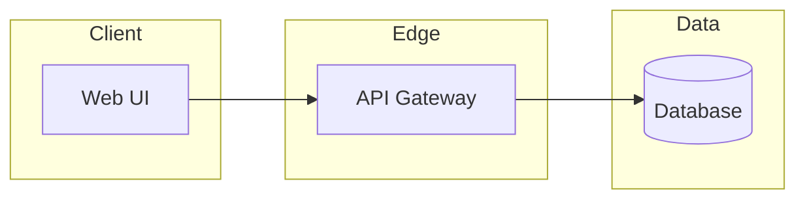

**Deployment / nodes** — show *where* things run (use shapes: `[/Firewall/]`, `[(DB)]`, rectangles for VMs/services):

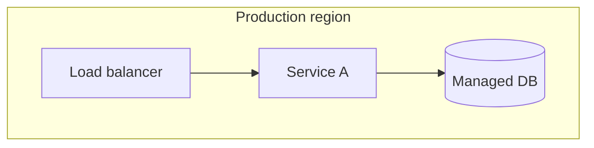

**Technology stack (vertical)** — top-down stack:

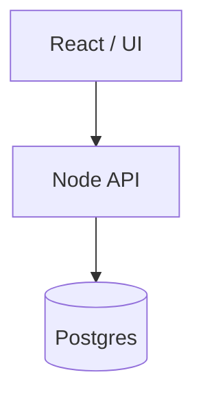

**Network / data path** — keep arrows meaningful (protocol names in edge labels if useful):

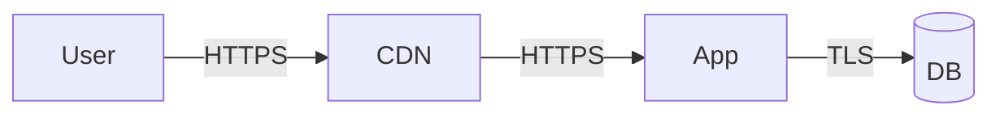

## UML in Mermaid

**Class diagram** — attributes/methods optional; relationships: `<|--` inheritance, `*--` composition, `o--` aggregation, `-->` dependency:

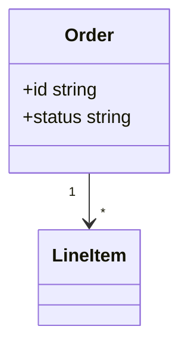

**Sequence diagram** — APIs and time ordering:

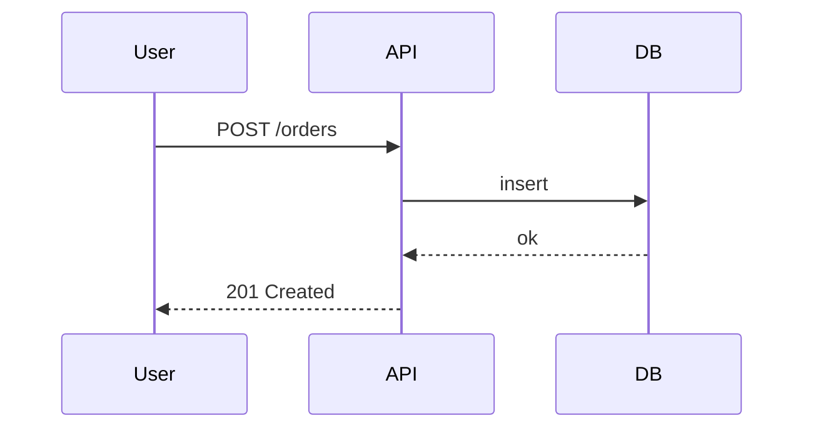

**State diagram** — lifecycles:

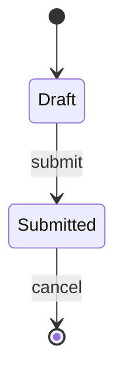

**Activity / process** — use `flowchart` with diamond decisions `{{Condition}}` or `stateDiagram` for strict states.

**Use case** — Mermaid has no native use-case diagram; approximate with `flowchart` (Actor rectangle + oval use cases) or describe use cases in a table and use a simple relationship sketch.

## Workflow & process

**Flowchart** — decisions and loops:

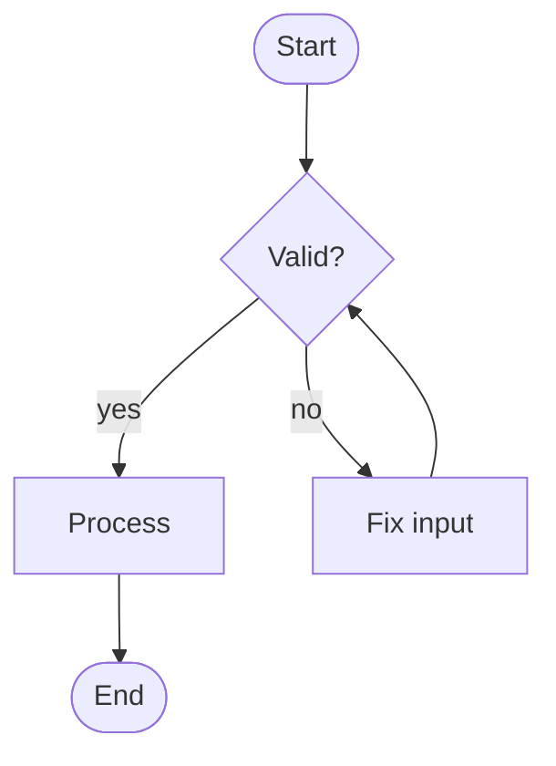

**Swimlanes** — subgraph per lane (team / system):

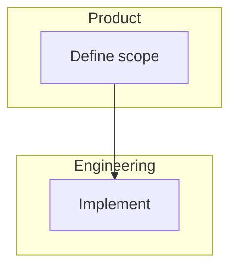

**Customer journey** — stages left-to-right with emotions or pain as notes in prose below; diagram shows steps only.

## Data & logic

**ER diagram** — Mermaid `erDiagram`:

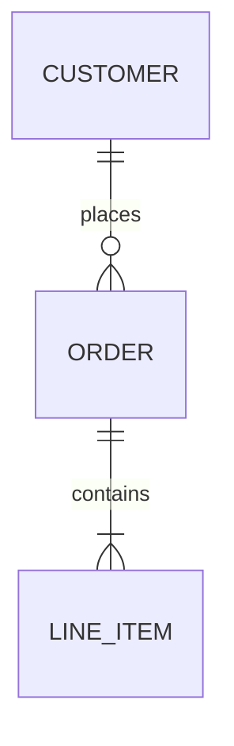

**Data flow (DFD-style)** — processes as nodes, stores as cylinders/files, flows labeled:

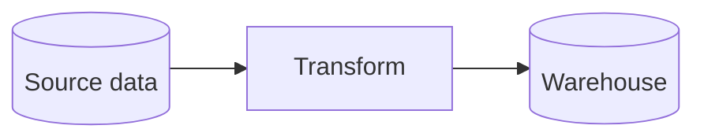

## Systems engineering habits

- **Context → container → component**: start with one context diagram; drill down in separate figures.
- **Interfaces**: label edges with contract (REST event queue file) not vague “talks to”.
- **Trust boundaries**: subgraph for “inside VPC” vs “public internet”.
- **Failure paths**: optional dashed line or note in prose for retries DLQ.

## Anti-patterns

- Giant diagrams that mix deployment + sequence + ER — split.
- Unlabeled arrows between anonymous nodes.
- Pasting secrets URLs tokens into diagrams.

## Optional reference

For large teams that standardize on other DaC tools (PlantUML Structurizr) mention them in prose only — **default in this repo remains Mermaid** in markdown.

See [reference.md](reference.md) for copy-paste templates by diagram type.
