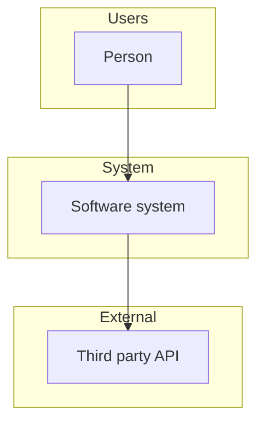
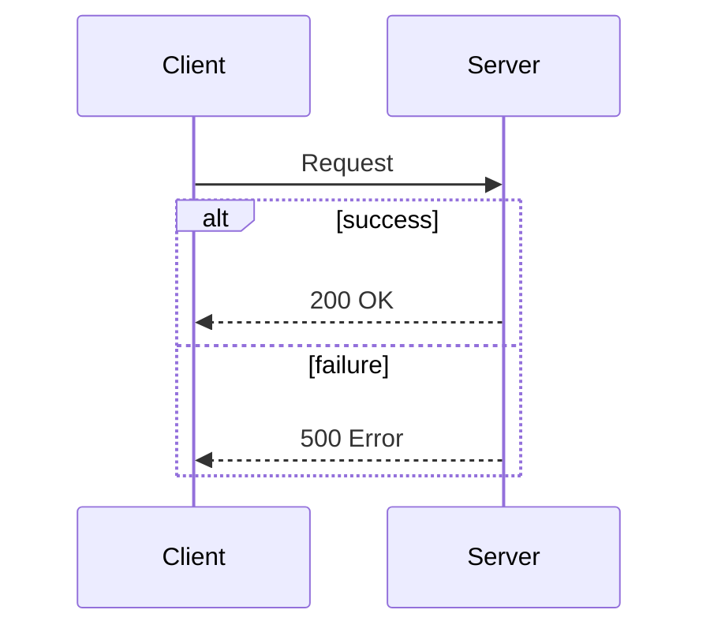
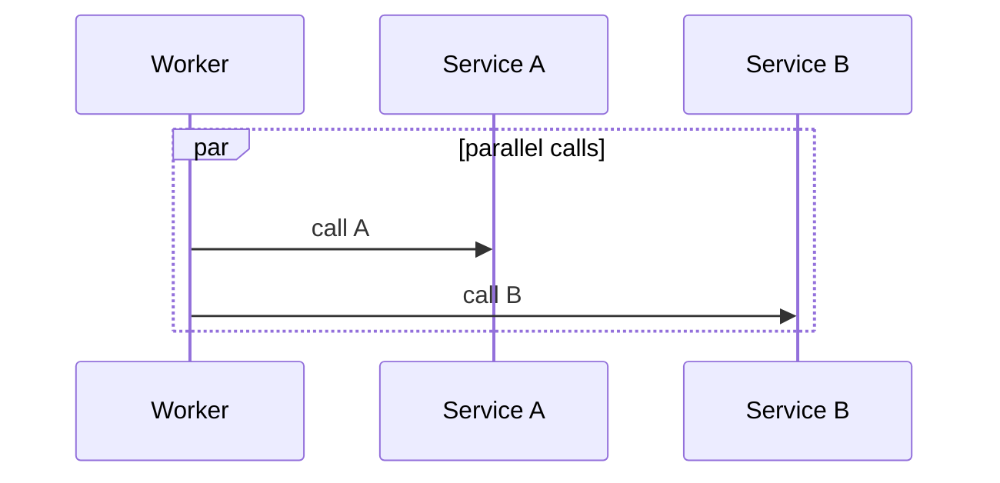
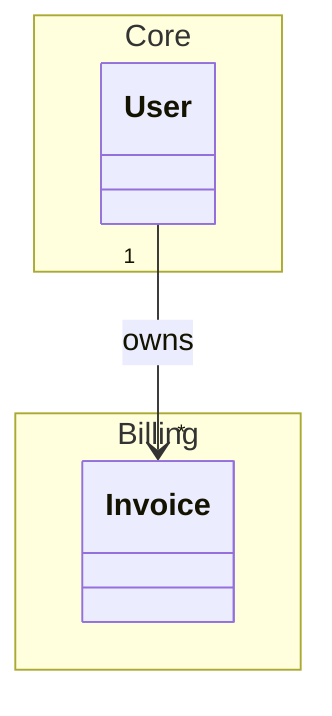
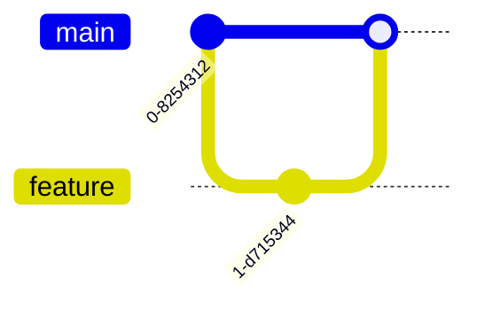
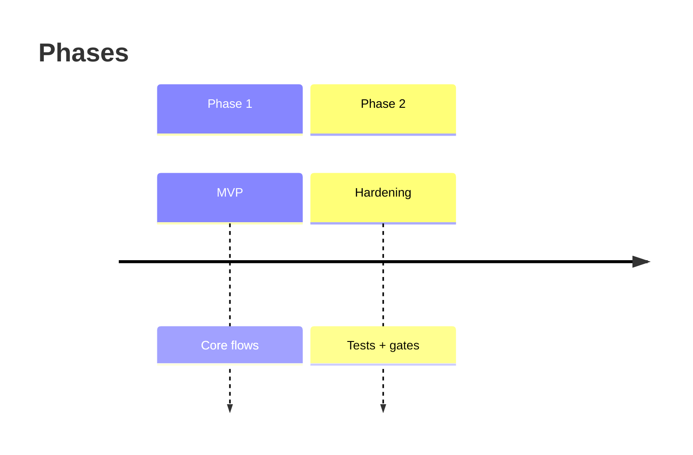
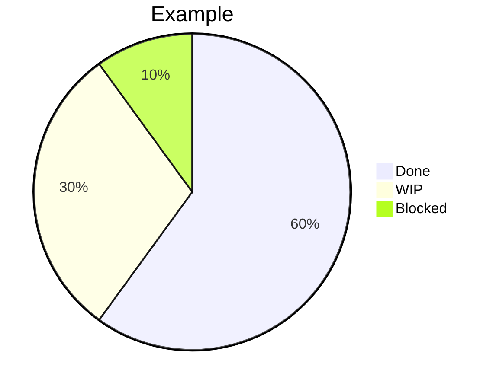

# Mermaid — extended templates

Use these as starting points; trim nodes to fit the conversation.

## C4-style (informal) context

## Sequence with alt/opt (fragments)

Mermaid sequence diagrams support `alt` / `else` / `end`:

## Parallel / async hint

Use `par` blocks in sequence diagrams when relevant:

## Package / module grouping (class diagram)

## Git graph (history)

## Timeline (roadmaps)

## Pie chart (lightweight metrics)

## Notes on tooling context

Teams often use whiteboard tools (e.g. Miro, Lucidchart, draw.io, Figma) for workshops; **for repo-backed specs**, still prefer Mermaid so the diagram versions with the PR.
