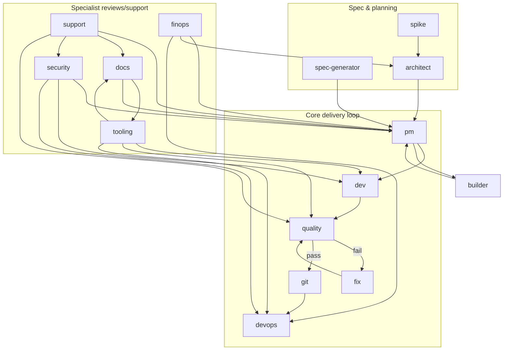

# SaaS Factory — Agent Map (handoffs)

This diagram shows the **handoff graph** between SaaS Factory agent roles.

- Source of truth: `factory/agent-registry.json` (`next_agents`) plus the explicit `quality_gate_loop`.
- Purpose: make it obvious “who comes next” without re-reading every role file.

