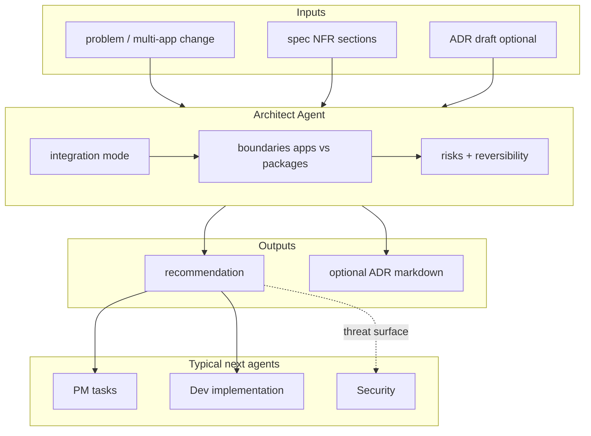

# Architect Agent — process diagram

**Category:** advisory · **Role file:** `agents/architect-agent.md`

```mermaid
flowchart TB
  subgraph inputs["Inputs"]
    PS["problem / multi-app change"]
    SN["spec NFR sections"]
    ADR0["ADR draft optional"]
  end

  subgraph arch["Architect Agent"]
    IM["integration mode"]
    BD["boundaries apps vs packages"]
    RW["risks + reversibility"]
    IM --> BD --> RW
  end

  subgraph outputs["Outputs"]
    REC["recommendation"]
    ADR["optional ADR markdown"]
  end

  subgraph next["Typical next agents"]
    PM["PM tasks"]
    DV["Dev implementation"]
    SEC["Security"]
  end

  PS --> arch
  SN --> arch
  ADR0 --> arch
  arch --> REC
  arch --> ADR
  REC --> PM
  REC --> DV
  REC -.->|threat surface| SEC
```
