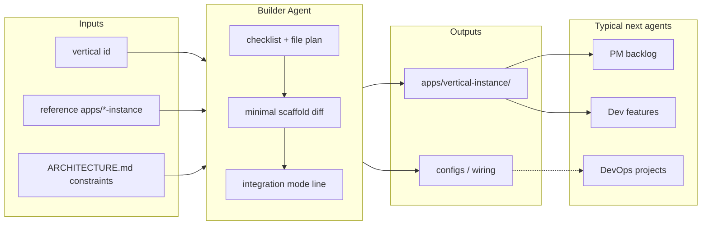

# Builder Agent — process diagram

**Category:** execution · **Role file:** `agents/builder-agent.md`

```mermaid
flowchart LR
  subgraph inputs["Inputs"]
    VID["vertical id"]
    REF["reference apps/*-instance"]
    ARC["ARCHITECTURE.md constraints"]
  end

  subgraph bl["Builder Agent"]
    CHK["checklist + file plan"]
    MIN["minimal scaffold diff"]
    MODE["integration mode line"]
    CHK --> MIN --> MODE
  end

  subgraph outputs["Outputs"]
    APP["apps/vertical-instance/"]
    CFG["configs / wiring"]
  end

  subgraph next["Typical next agents"]
    PM["PM backlog"]
    DV["Dev features"]
    DO["DevOps projects"]
  end

  VID --> bl
  REF --> bl
  ARC --> bl
  bl --> APP
  bl --> CFG
  APP --> PM
  APP --> DV
  CFG -.-> DO
```
