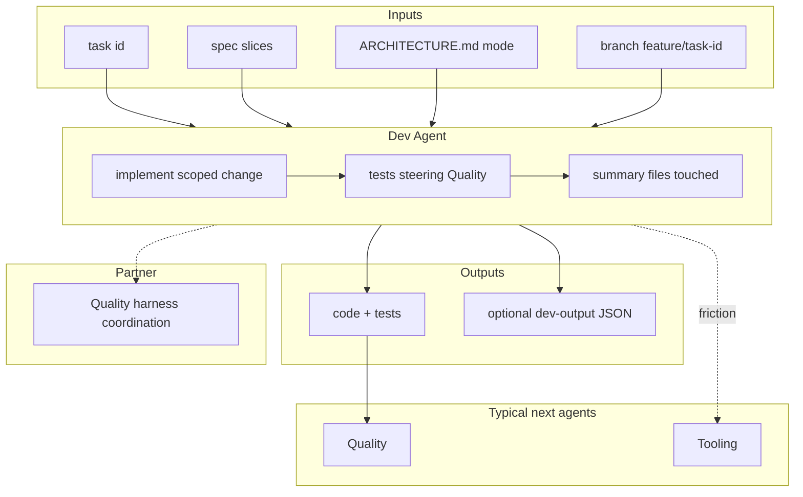

# Dev Agent — process diagram

**Category:** execution · **Role file:** `agents/dev-agent.md`

```mermaid
flowchart TB
  subgraph inputs["Inputs"]
    TID["task id"]
    SPEC["spec slices"]
    ARCH["ARCHITECTURE.md mode"]
    BR["branch feature/task-id"]
  end

  subgraph dev["Dev Agent"]
    IMPL["implement scoped change"]
    TEST["tests steering Quality"]
    SUM["summary files touched"]
    IMPL --> TEST --> SUM
  end

  subgraph outputs["Outputs"]
    CODE["code + tests"]
    HAND["optional dev-output JSON"]
  end

  subgraph partner["Partner"]
    QUH["Quality harness coordination"]
  end

  subgraph next["Typical next agents"]
    QU["Quality"]
    TO["Tooling"]
  end

  TID --> dev
  SPEC --> dev
  ARCH --> dev
  BR --> dev
  dev --> CODE
  dev --> HAND
  CODE --> QU
  dev -.->|friction| TO
  dev -.-> QUH
```
