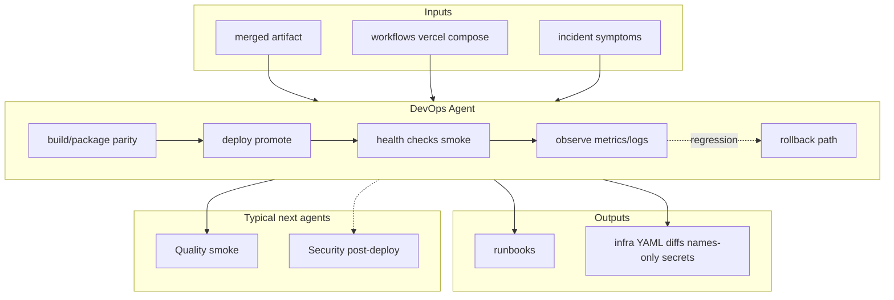

# DevOps Agent — process diagram

**Category:** execution · **Role file:** `agents/devops-agent.md`

```mermaid
flowchart TB
  subgraph inputs["Inputs"]
    MR["merged artifact"]
    WF["workflows vercel compose"]
    INC["incident symptoms"]
  end

  subgraph dov["DevOps Agent"]
    BLD["build/package parity"]
    DEP["deploy promote"]
    OBS["observe metrics/logs"]
    RB["rollback path"]
    HLTH["health checks smoke"]
    BLD --> DEP --> HLTH --> OBS
    OBS -.->|regression| RB
  end

  subgraph outputs["Outputs"]
    RBK["runbooks"]
    YML["infra YAML diffs names-only secrets"]
  end

  subgraph next["Typical next agents"]
    QU["Quality smoke"]
    SEC["Security post-deploy"]
  end

  MR --> dov
  WF --> dov
  INC --> dov
  dov --> RBK
  dov --> YML
  dov --> QU
  dov -.-> SEC
```
