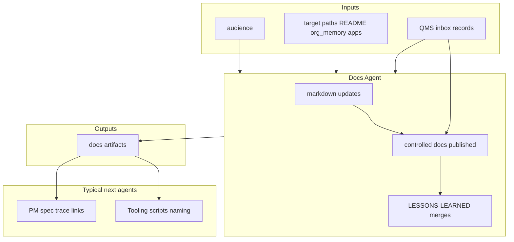

# Docs Agent — process diagram

**Category:** advisory · **Role file:** `agents/docs-agent.md`

```mermaid
flowchart TB
  subgraph inputs["Inputs"]
    AUD["audience"]
    PATH["target paths README org_memory apps"]
    QIN["QMS inbox records"]
  end

  subgraph dc["Docs Agent"]
    MD["markdown updates"]
    QMS["controlled docs published"]
    LESS["LESSONS-LEARNED merges"]
    MD --> QMS
    QIN --> QMS
    QMS --> LESS
  end

  subgraph outputs["Outputs"]
    DOC["docs artifacts"]
  end

  subgraph next["Typical next agents"]
    TO["Tooling scripts naming"]
    PM["PM spec trace links"]
  end

  AUD --> dc
  PATH --> dc
  QIN --> dc
  dc --> DOC
  DOC --> TO
  DOC --> PM
```
