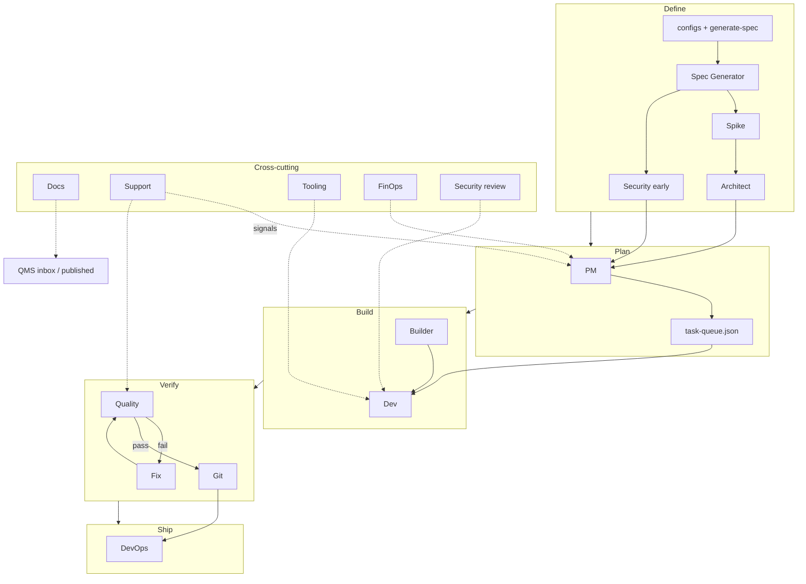

# Factory delivery spine (all agents in context)

High-level flow showing where agents sit relative to **`factory/task-queue.json`** and **Quality** gate.

```mermaid
flowchart TB
  subgraph define["Define"]
    CFG["configs + generate-spec"]
    SG["Spec Generator"]
    SP["Spike"]
    AR["Architect"]
    SEC1["Security early"]
    CFG --> SG
    SG --> SP
    SP --> AR
    SG --> SEC1
  end

  subgraph plan["Plan"]
    PM["PM"]
    TQ["task-queue.json"]
    PM --> TQ
  end

  subgraph build["Build"]
    BL["Builder"]
    DV["Dev"]
    BL --> DV
  end

  subgraph verify["Verify"]
    QU["Quality"]
    FX["Fix"]
    QU -->|fail| FX
    FX --> QU
    QU -->|pass| GT["Git"]
  end

  subgraph ship["Ship"]
    DO["DevOps"]
    GT --> DO
  end

  subgraph always["Cross-cutting"]
    DC["Docs"]
    SU["Support"]
    TO["Tooling"]
    FI["FinOps"]
    SEC2["Security review"]
  end

  define --> plan
  AR --> PM
  SEC1 --> PM
  plan --> build
  TQ --> DV
  build --> verify
  verify --> ship

  SU -.->|signals| PM
  SU -.-> QU
  FI -.-> PM
  SEC2 -.-> DV
  TO -.-> DV
  DC -.-> QMS["QMS inbox / published"]
```
