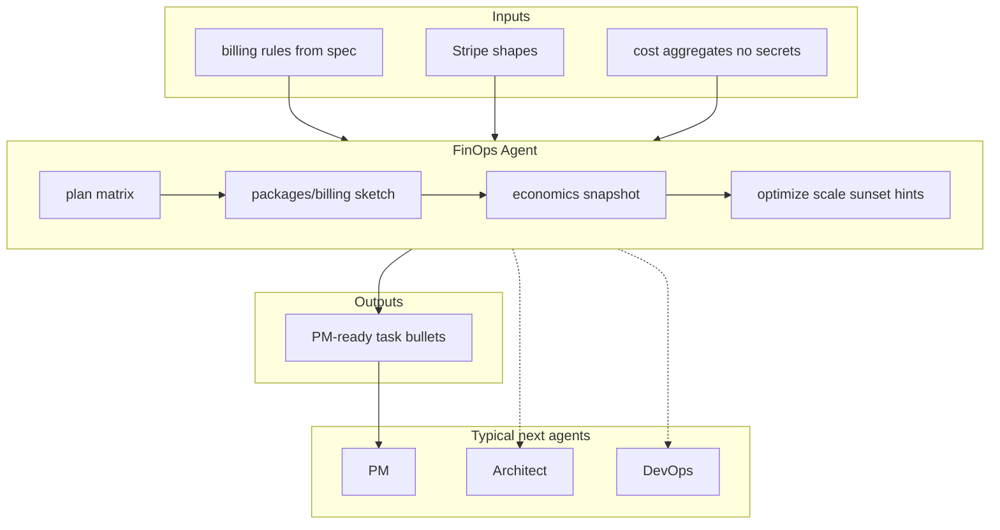

# FinOps Agent — process diagram

**Category:** advisory · **Role file:** `agents/finops-agent.md`

```mermaid
flowchart TB
  subgraph inputs["Inputs"]
    BILL["billing rules from spec"]
    STR["Stripe shapes"]
    COST["cost aggregates no secrets"]
  end

  subgraph fo["FinOps Agent"]
    PMX["plan matrix"]
    SK["packages/billing sketch"]
    EC["economics snapshot"]
    REC["optimize scale sunset hints"]
    PMX --> SK --> EC --> REC
  end

  subgraph outputs["Outputs"]
    TASK["PM-ready task bullets"]
  end

  subgraph next["Typical next agents"]
    PM["PM"]
    AR["Architect"]
    DO["DevOps"]
  end

  BILL --> fo
  STR --> fo
  COST --> fo
  fo --> TASK
  TASK --> PM
  fo -.-> AR
  fo -.-> DO
```
