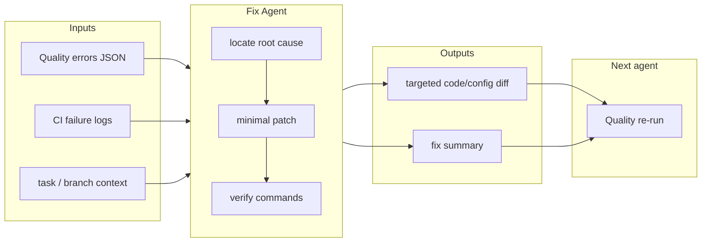

# Fix Agent — process diagram

**Category:** execution · **Role file:** `agents/fix-agent.md`

```mermaid
flowchart LR
  subgraph inputs["Inputs"]
    QE["Quality errors JSON"]
    LOG["CI failure logs"]
    TID["task / branch context"]
  end

  subgraph fix["Fix Agent"]
    LOC["locate root cause"]
    PAT["minimal patch"]
    VF["verify commands"]
    LOC --> PAT --> VF
  end

  subgraph outputs["Outputs"]
    DIFF["targeted code/config diff"]
    SUM["fix summary"]
  end

  subgraph next["Next agent"]
    QU["Quality re-run"]
  end

  QE --> fix
  LOG --> fix
  TID --> fix
  fix --> DIFF
  fix --> SUM
  DIFF --> QU
  SUM --> QU
```
