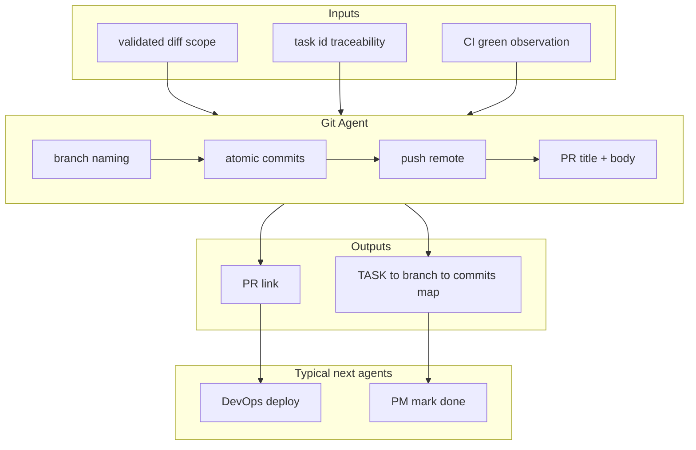

# Git Agent — process diagram

**Category:** execution · **Role file:** `agents/git-agent.md`

```mermaid
flowchart TB
  subgraph inputs["Inputs"]
    DIFF["validated diff scope"]
    TID["task id traceability"]
    CIS["CI green observation"]
  end

  subgraph git["Git Agent"]
    BR["branch naming"]
    CM["atomic commits"]
    PS["push remote"]
    PR["PR title + body"]
    BR --> CM --> PS --> PR
  end

  subgraph outputs["Outputs"]
    LINK["PR link"]
    META["TASK to branch to commits map"]
  end

  subgraph next["Typical next agents"]
    DO["DevOps deploy"]
    PM["PM mark done"]
  end

  DIFF --> git
  TID --> git
  CIS --> git
  git --> LINK
  git --> META
  LINK --> DO
  META --> PM
```
