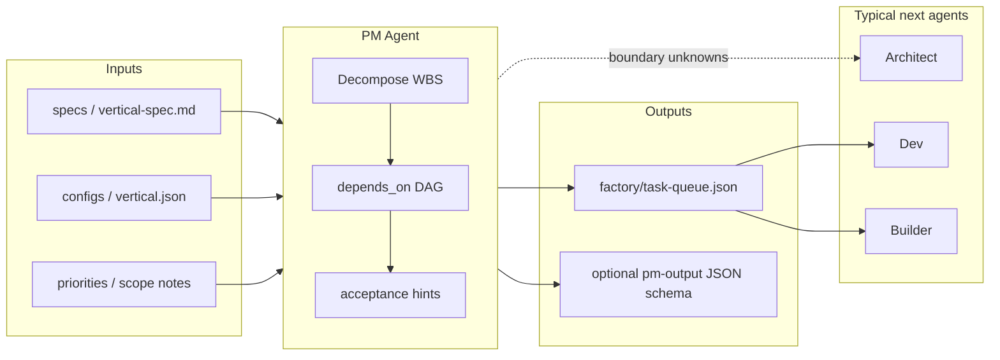

# PM Agent — process diagram

**Category:** execution · **Role file:** `agents/pm-agent.md`

```mermaid
flowchart LR
  subgraph inputs["Inputs"]
    SPEC["specs / vertical-spec.md"]
    CFG["configs / vertical.json"]
    HINT["priorities / scope notes"]
  end

  subgraph pm["PM Agent"]
    WBS["Decompose WBS"]
    DAG["depends_on DAG"]
    AC["acceptance hints"]
    WBS --> DAG --> AC
  end

  subgraph outputs["Outputs"]
    TQ["factory/task-queue.json"]
    JSON["optional pm-output JSON schema"]
  end

  subgraph next["Typical next agents"]
    AR["Architect"]
    DV["Dev"]
    BL["Builder"]
  end

  SPEC --> pm
  CFG --> pm
  HINT --> pm
  pm --> TQ
  pm --> JSON
  TQ --> DV
  TQ --> BL
  pm -.->|boundary unknowns| AR
```
