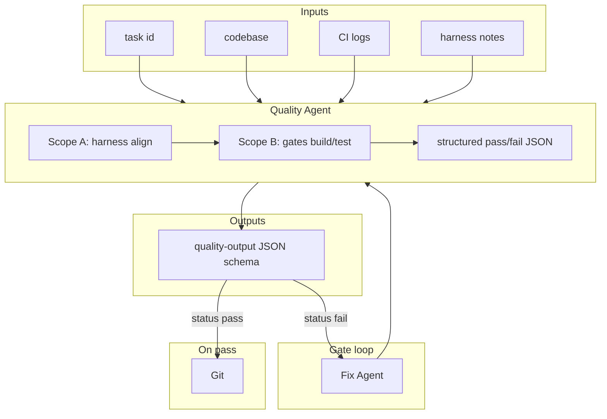

# Quality Agent — process diagram

**Category:** execution · **Role file:** `agents/quality-agent.md`  
*(Legacy redirects: `testing-agent`, `qa-agent` → same role.)*

```mermaid
flowchart TB
  subgraph inputs["Inputs"]
    TID["task id"]
    CB["codebase"]
    CI["CI logs"]
    HN["harness notes"]
  end

  subgraph qa["Quality Agent"]
    H["Scope A: harness align"]
    G["Scope B: gates build/test"]
    R["structured pass/fail JSON"]
    H --> G --> R
  end

  subgraph outputs["Outputs"]
    QJ["quality-output JSON schema"]
  end

  subgraph loop["Gate loop"]
    FX["Fix Agent"]
  end

  subgraph nextpass["On pass"]
    GT["Git"]
  end

  TID --> qa
  CB --> qa
  CI --> qa
  HN --> qa
  qa --> QJ
  QJ -->|status fail| FX
  FX --> qa
  QJ -->|status pass| GT
```
