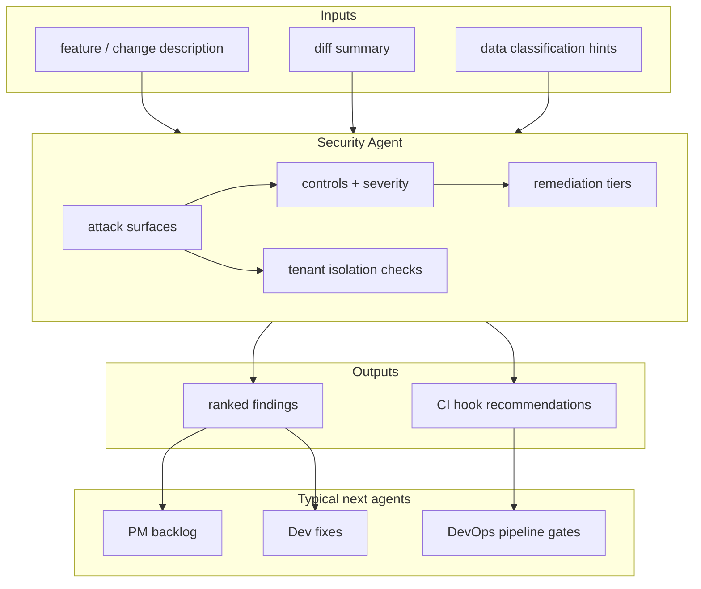

# Security Agent — process diagram

**Category:** advisory · **Role file:** `agents/security-agent.md`

```mermaid
flowchart TB
  subgraph inputs["Inputs"]
    FEAT["feature / change description"]
    DIFF["diff summary"]
    DC["data classification hints"]
  end

  subgraph sec["Security Agent"]
    AS["attack surfaces"]
    CL["controls + severity"]
    RT["remediation tiers"]
    TEN["tenant isolation checks"]
    AS --> CL --> RT
    AS --> TEN
  end

  subgraph outputs["Outputs"]
    RR["ranked findings"]
    CIH["CI hook recommendations"]
  end

  subgraph next["Typical next agents"]
    PM["PM backlog"]
    DV["Dev fixes"]
    DO["DevOps pipeline gates"]
  end

  FEAT --> sec
  DIFF --> sec
  DC --> sec
  sec --> RR
  sec --> CIH
  RR --> PM
  RR --> DV
  CIH --> DO
```
