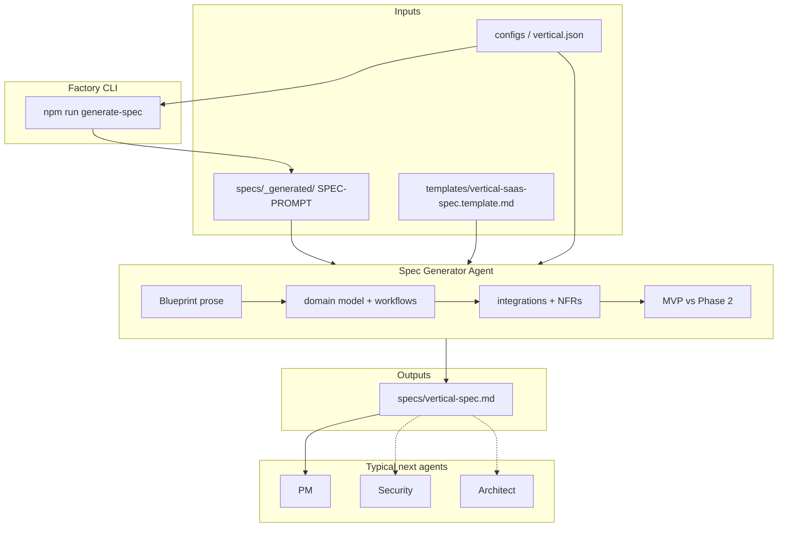

# Spec Generator Agent — process diagram

**Category:** execution · **Role file:** `agents/spec-generator-agent.md`

```mermaid
flowchart TB
  subgraph inputs["Inputs"]
    CJ["configs / vertical.json"]
    GEN["specs/_generated/ SPEC-PROMPT"]
    TMPL["templates/vertical-saas-spec.template.md"]
  end

  subgraph cli["Factory CLI"]
    NS["npm run generate-spec"]
  end

  subgraph sg["Spec Generator Agent"]
    BP["Blueprint prose"]
    DM["domain model + workflows"]
    INT["integrations + NFRs"]
    MVP["MVP vs Phase 2"]
    BP --> DM --> INT --> MVP
  end

  subgraph outputs["Outputs"]
    SM["specs/vertical-spec.md"]
  end

  subgraph next["Typical next agents"]
    PM["PM"]
    SEC["Security"]
    AR["Architect"]
  end

  CJ --> NS
  NS --> GEN
  GEN --> sg
  TMPL --> sg
  CJ --> sg
  sg --> SM
  SM --> PM
  SM -.-> SEC
  SM -.-> AR
```
