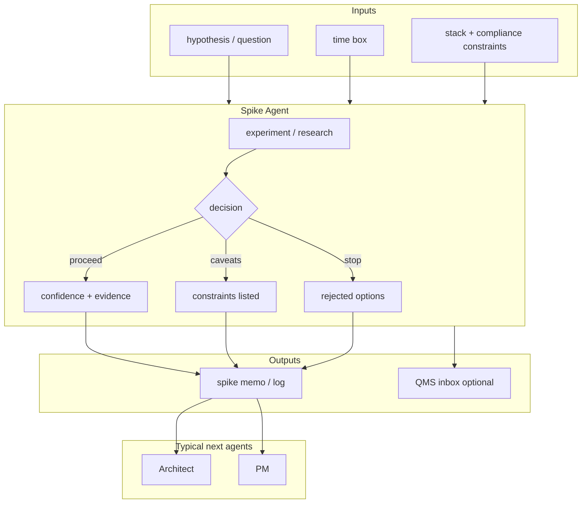

# Spike Agent — process diagram

**Category:** advisory · **Role file:** `agents/spike-agent.md`

```mermaid
flowchart TB
  subgraph inputs["Inputs"]
    HYP["hypothesis / question"]
    TB["time box"]
    CON["stack + compliance constraints"]
  end

  subgraph spike["Spike Agent"]
    EXP["experiment / research"]
    DEC{"decision"}
    EXP --> DEC
    DEC -->|proceed| P1["confidence + evidence"]
    DEC -->|caveats| P2["constraints listed"]
    DEC -->|stop| P3["rejected options"]
  end

  subgraph outputs["Outputs"]
    MEM["spike memo / log"]
    QMS["QMS inbox optional"]
  end

  subgraph next["Typical next agents"]
    AR["Architect"]
    PM["PM"]
  end

  HYP --> spike
  TB --> spike
  CON --> spike
  P1 --> MEM
  P2 --> MEM
  P3 --> MEM
  MEM --> AR
  MEM --> PM
  spike --> QMS
```
