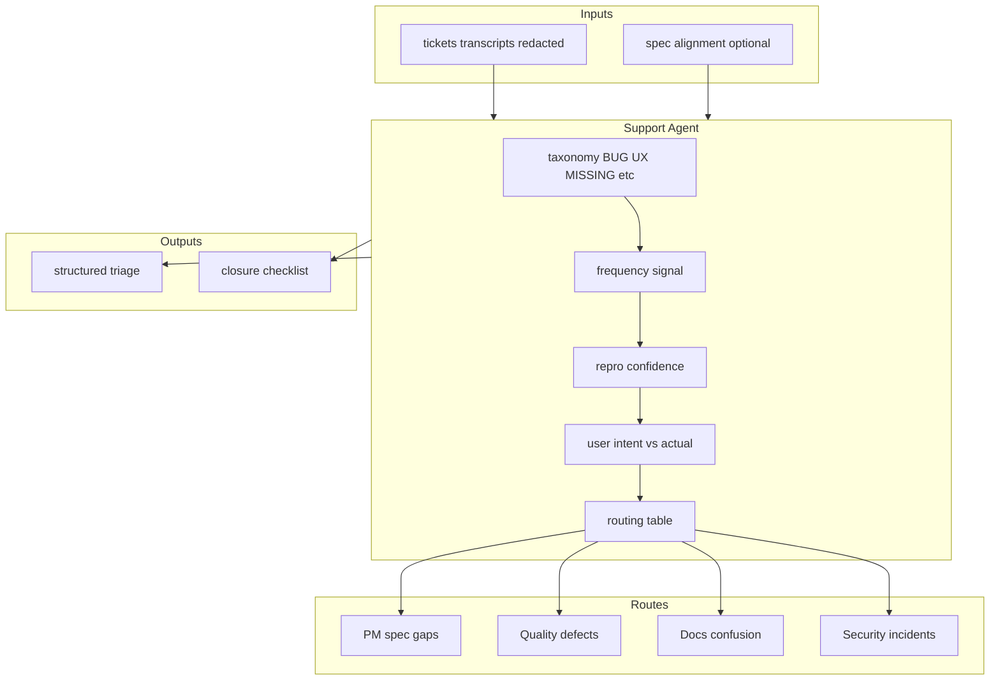

# Support Agent — process diagram

**Category:** advisory · **Role file:** `agents/support-agent.md`

```mermaid
flowchart TB
  subgraph inputs["Inputs"]
    TK["tickets transcripts redacted"]
    SPEC["spec alignment optional"]
  end

  subgraph sup["Support Agent"]
    TX["taxonomy BUG UX MISSING etc"]
    FREQ["frequency signal"]
    RC["repro confidence"]
    INT["user intent vs actual"]
    RT["routing table"]
    TX --> FREQ --> RC --> INT --> RT
  end

  subgraph outputs["Outputs"]
    TRI["structured triage"]
    CLS["closure checklist"]
  end

  subgraph next["Routes"]
    PM["PM spec gaps"]
    QU["Quality defects"]
    DC["Docs confusion"]
    SEC["Security incidents"]
  end

  TK --> sup
  SPEC --> sup
  sup --> TRI
  sup --> CLS
  RT --> PM
  RT --> QU
  RT --> DC
  RT --> SEC
```
