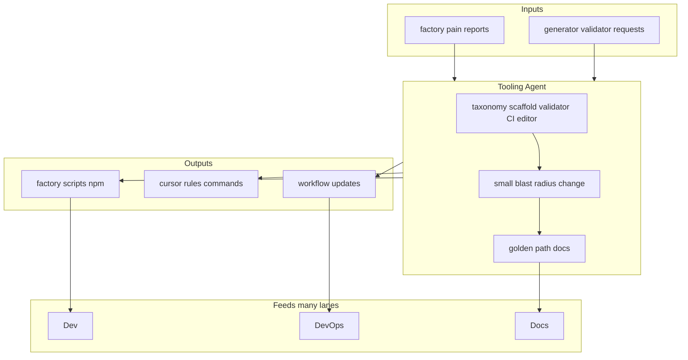

# Tooling Agent — process diagram

**Category:** execution · **Role file:** `agents/tooling-agent.md`

```mermaid
flowchart TB
  subgraph inputs["Inputs"]
    PN["factory pain reports"]
    REQ["generator validator requests"]
  end

  subgraph tl["Tooling Agent"]
    TX["taxonomy scaffold validator CI editor"]
    SM["small blast radius change"]
    GP["golden path docs"]
    TX --> SM --> GP
  end

  subgraph outputs["Outputs"]
    SCR["factory scripts npm"]
    CR["cursor rules commands"]
    GHA["workflow updates"]
  end

  subgraph feeds["Feeds many lanes"]
    DV["Dev"]
    DO["DevOps"]
    DC["Docs"]
  end

  PN --> tl
  REQ --> tl
  tl --> SCR
  tl --> CR
  tl --> GHA
  SCR --> DV
  GHA --> DO
  GP --> DC
```
