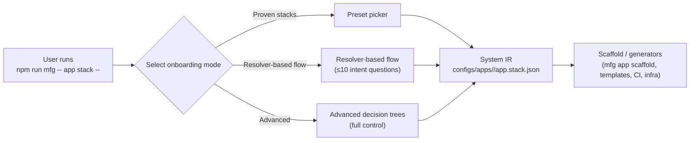
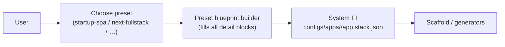
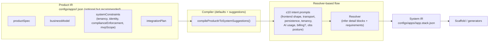
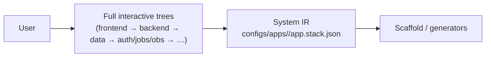

## SaaS Factory — Blueprint flows diagrams

This explains how **`npm run mfg -- app stack -- <app>`** produces **System IR** (`configs/apps/<app>/app.stack.json`) in multiple ways.

### Mode: Proven stacks

### Mode: Resolver-based flow (Product IR → Compiler → System IR → scaffold)

### Mode: Advanced decision trees

