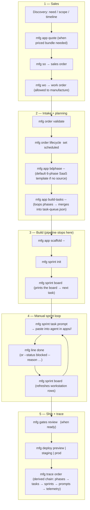

# Sales and the assembly line — simple guide

## The idea in one sentence

Sales turns a customer need into a **signed work order**; the factory turns that order into **phases → tasks → an agent-driven sprint loop → a deploy**, with every step traceable through `mfg trace order <orderId>`.

## Diagram — from conversation to running software



## The ordered steps

1. **Discovery.** Capture problem, users, must-haves vs nice-to-haves, timeline, sign-off owner.
2. **Quote** (when needed): `npm run mfg -- app quote -- <slug>`.
3. **Sales order:** `npm run mfg -- so`.
4. **Work order:** `npm run mfg -- wo` → factory is allowed to manufacture.
5. **Intake check:** `npm run mfg -- order validate <orderId>`.
6. **Lifecycle:** `npm run mfg -- order lifecycle <orderId> set scheduled`.
7. **Phases:** `npm run mfg -- app bdphase -- <orderId>` (synthesizes the default 6-phase SaaS plan if no `phase-queue.json` / `PHASES.md` source exists).
8. **Tasks:** `npm run mfg -- app build-tasks -- <orderId>` — loops every phase, writes per-phase `phase-breakdown-*.json`, auto-merges into `task-queue.json`.
9. **Scaffold:** `npm run mfg -- app scaffold -- <slug>` (frontend + API workspaces).
10. **Sprint init:** `npm run mfg -- sprint init <orderId> <slug> --title "…" --goal "…"`. **The automated pipeline ends here.**
11. **Sprint board:** `npm run mfg -- sprint board <orderId> <slug>` — prints tasks grouped by phase, computes the four workstation rows from the queue, and points at the next ready task.
12. **Hand the task to an agent:** `npm run mfg -- sprint task prompt <taskId>` writes `sprint-NNN/prompts/<taskId>.md` and prints it; open the file from a second Cursor window scoped to `apps/<slug>/`.
13. **Mark complete:** `npm run mfg -- line done <taskId>` (or `--status blocked --reason "<why>"`).
14. **Re-run the board** and repeat 12–13 until every task is done.
15. **Delivery review** (when ready): `npm run mfg -- gates review <orderId> <slug>`.
16. **Deploy:** `npm run mfg -- deploy preview` → `staging` → `prod` (`preview` is fast feedback; `staging`/`prod` require clean `main` + clean tree).
17. **Trace the chain:** `npm run mfg -- trace order <orderId>` — reads `factory/08_traceability/orders/<orderId>.json` (phases → tasks → sprints → prompts → telemetry, with source pointers).

### One-shot variants

```bash
npm run pipeline      -- <slug>     # runs steps 2–11, then stops at sprint hand-off
npm run pipeline:plan -- <slug>     # prints the plan, doesn't execute
npm run purge         -- <slug>     # removes every artifact for that slug (incl. trace index)
```

Opt back into the legacy auto-downstream chain with `--with-gates-review`, `--with-deploy`, `--with-kaizen`, `--with-metrics`, `--with-verified`, or `--full-auto`.
