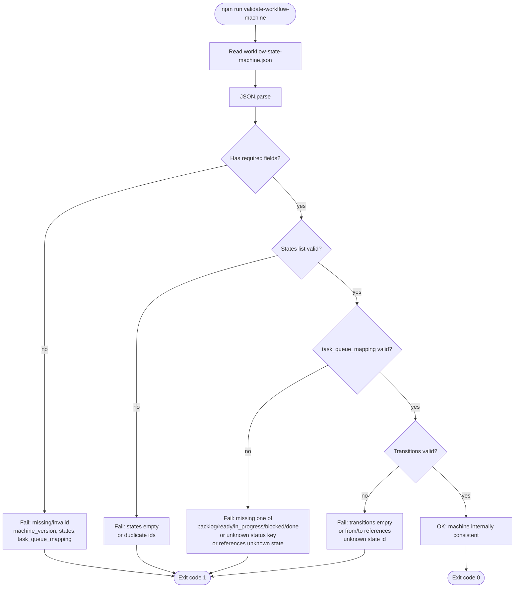

# `validate-workflow-machine` — what it checks

This note documents what `npm run validate-workflow-machine` validates, in plain terms.

- **Validator code**: `factory/validate-workflow-machine.ts`
- **Input file**: `factory/workflow-state-machine.json`

## Mermaid map (validator flow)

## Important limitation (what it does *not* check)

This validator checks that the **workflow definition file is consistent with itself**.

It does **not** yet verify that `factory/task-queue.json` tasks are “following” the workflow (that would be a separate validator comparing task statuses/metadata to workflow rules).