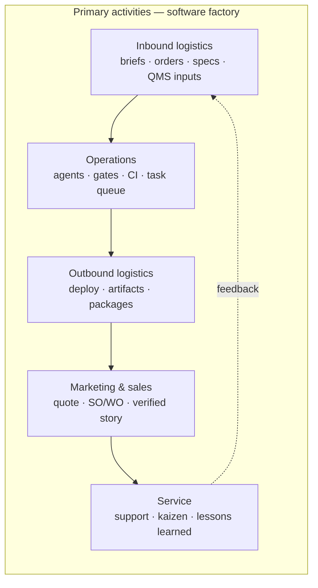
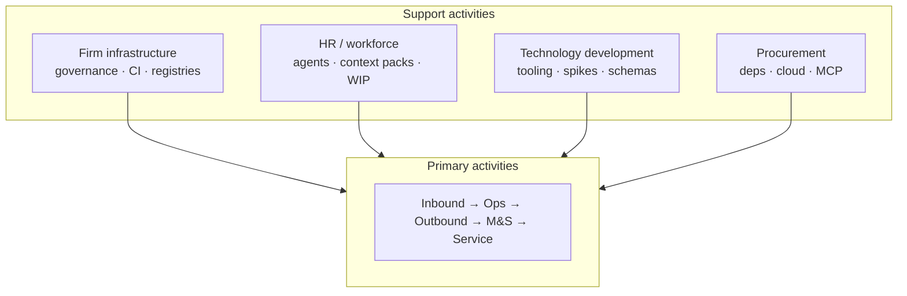

# Software factory value chain (Porter-style)

This document maps **Michael Porter’s generic value chain** to **this monorepo’s software factory**: agents, `mfg` CLIs, registries, and knowledge base — *not* a single product’s in-app feature backlog.

Porter separates **primary activities** (work that flows toward customer value) from **support activities** (capabilities that make primaries possible). For a software factory, “customer” is often **the operator / business** receiving a **verified vertical** (or internal platform capability), and “supplier” is **inputs** (briefs, contracts, standards).

---

## 1. Primary activities (flow of value)

| Porter activity | Meaning in a **software factory** | This repo (examples) |
|-----------------|-------------------------------------|------------------------|
| **Inbound logistics** | Bringing **work and constraints** into the line in a shippable shape: specs, configs, orders, policies, evidence templates. | `configs/apps/<slug>/` (brief, stack, specs), `factory/01_production_planning/01_00_work_orders/`, `order validate` / `so` / `wo`, QMS inbox templates, `task-queue.json` fed by PM output. |
| **Operations** | **Transforming** inputs into integrated software: design, implement, verify, merge — with explicit gates. | `@agents/*-agent.md` chains (Dev → Quality → Fix → Git), `mfg line next` / `line queue` / `line done`, `mfg line orchestrate`, `gates review`, `npm run check`, `mfg validate factory`, CI (`factory-parallel-ci.yml`). |
| **Outbound logistics** | **Delivering** increments to the environment where value is consumed: artifacts, deployables, handoff packs. | `mfg deploy` (preview → staging → prod), CI artifacts (`factory-next.json`), `08-delivery/`, app instances under `apps/*-instance/`, packages under `packages/*`. |
| **Marketing & sales** | **Commercializing** the factory’s outputs: quoting, scoping, admitting work, explaining what “verified” means. | `go_to_market/SALES-AND-ASSEMBLY-LINE-GUIDE.md`, `mfg app quote` / `so` / `wo`, verified product zone (`factory/07_verified_product/`), specs as promise of value. |
| **Service** | **Sustaining** value after delivery: incidents, FAQ, feedback into backlog/spec. | `@agents/support-agent.md`, runbooks in docs, kaizen (`mfg kaizen`), lessons in QMS, reopening spec/tasks from field signal. |

---

## 2. Support activities (cross-cutting capabilities)

| Porter activity | Meaning in a **software factory** | This repo (examples) |
|-----------------|-------------------------------------|------------------------|
| **Firm infrastructure** | Governance, planning, finance/legal posture, **integrity of the machine**. | `routing/AGENTS.md`, `FACTORY-PROCESS.md`, ADRs, `ARCHITECTURE.md`, `workflow-state-machine.json`, `MISSION-CONTROL.md`, `npm run mfg -- validate factory`, GitHub Projects setup. |
| **Human resource management** | **Workforce model**: roles, skills, pairing, capacity — here mostly **agent + human** teaming. | `factory/02_workforce/` (agent definitions, registry, context packs, workstations), Dev+Quality partnership, WIP limits (`line next`, `LEAN-MANUFACTURING.md`). |
| **Technology development** | **Improving the factory itself**: new gates, better scaffolds, telemetry, SDK experiments. | `@agents/tooling-agent.md`, `@agents/spike-agent.md`, `@agents/architect-agent.md`, `factory/factory_cli/`, `factory/factory_libs/`, `factory_specs/`, `factory_internal_ops/` (telemetry, cost). |
| **Procurement** | **Acquiring** external building blocks under policy: deps, cloud, tools, data. | `package.json` / workspaces, Azure or other hosts, MCP and IDE tooling, **FinOps agent** (judgment + vendor billing), dependency and secret hygiene (Security agent, DevOps). |

---

## 3. Margin (why the chain matters)

In Porter’s diagram, **margin** is the difference between buyer willingness to pay and full activity cost. For a software factory, margin is improved when:

- **Inbound** reduces rework (clear spec + task IDs + acceptance before build).
- **Operations** reduces defect cost (Quality gates, `validate factory`, small batches).
- **Outbound** reduces lead time to safe production (staged deploy, evidence).
- **Marketing & sales** reduces mismatch (quote → work order → same `task-queue.json`).
- **Service** closes the loop without firefighting (support → PM/spec → prioritized tasks).

Support activities pay off when they **lower cost or increase speed** in the primaries (e.g. better `mfg` DX reduces Operations time; firm infrastructure reduces coordination tax).

---

## 4. Mapping to “keep the factory alive”

Activities that **do not build a customer app** but **sustain the factory** span both sides:

| Sustainment theme | Porter bucket(s) | Examples |
|-------------------|------------------|----------|
| **Truth of registries** | Firm infrastructure + Technology development | `validate factory`, agent/tool/workflow registries, schemas. |
| **Observability of the line** | Technology development + Firm infrastructure | `factory_internal_ops/telemetry.ts`, assembly-line JSONL, `mfg telemetry`. |
| **Improvement rhythm** | HR + Service + Technology development | `mfg kaizen`, `mfg metrics collect`, QMS inbox → published docs. |
| **Economic guardrails** | Procurement + Firm infrastructure | FinOps agent; cost spec (`factory-os-cost-tracking-spec.md`) for future tooling; vendor billing outside repo. |

See also: **`LEAN-MANUFACTURING.md`** (waste and flow), **`MISSION-CONTROL.md`** (sources of truth), **`SALES-AND-ASSEMBLY-LINE-GUIDE.md`** (commercial + `mfg` spine).

---

## 5. Revision

| Field | Value |
|-------|--------|
| **Owner** | Process / PM (concept); Tooling for `mfg` alignment |
| **Status** | Living narrative — adjust when new primary/support surfaces appear |
