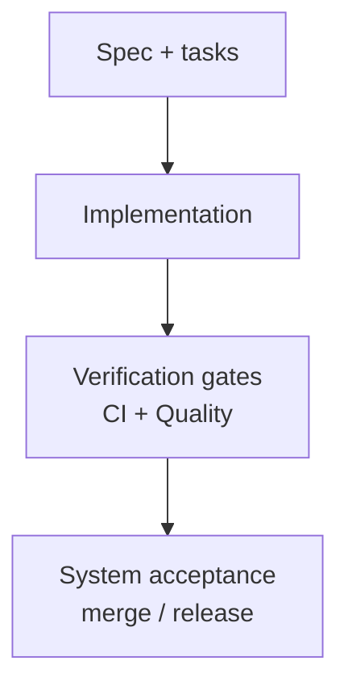

# System Verification Plan (System Acceptance)

## Document control

| Field | Value |
|-------|--------|
| **Document ID** | QMS-PUB-002 |
| **Revision** | 0.1 |
| **Status** | Draft |
| **Owner (role)** | Quality (with Dev / DevOps) |
| **Source records** | `factory/06_knowledge_base/qms_docs/inbox/2026-05-06-docs-ivv-published-suite.md` |
| **Applicable roles** | Dev, Quality, Fix, DevOps, Tooling |
| **Review due** | n/a |

## Purpose & scope

This document is the **system-level verification plan**: objective evidence that the integrated vertical (and shared packages as exercised) **conforms to stated system requirements** in specs and tasks, prior to treating a build as **accepted** for merge or release.

**In scope:** mandatory gates, CI alignment, traceability from requirements to checks, and escalation when gates fail.

**Out of scope:** proving business fit (see QMS-PUB-001), formal independent third-party IV&V unless the organization engages it outside this template.

## References

- `agents/quality-agent.md` — harness, environments, pass/fail reporting
- `factory/task-queue.json` — task ids and acceptance linkage
- `.github/workflows/` — CI jobs that enforce verification
- `factory/06_knowledge_base/architecture/ARCHITECTURE.md` — per-app CI matrix expectations
- QMS-PUB-003, QMS-PUB-004 — lower-level verification decomposition

## Verification approach

| Level | Objective | Typical evidence |
|-------|-----------|------------------|
| **Build / static** | Compile, lint, typecheck as configured | CI job logs |
| **Automated test** | Regressions tied to behavior in spec/tasks | Test reports |
| **Integration** | Cross-boundary behavior (DB, auth, API) | Compose / integration jobs when present |
| **Manual / checklist** | UX or scenarios not fully automated | Quality-maintained checklist |

## Procedure

1. **Gate definition** — For each vertical or release branch, Quality confirms which **root** scripts apply (`npm run check`, app-level `test` / `build` when wired per ARCHITECTURE).
2. **Traceability** — Prefer PR description or issue linking **task id** + spec section for verification scope.
3. **Execute** — Dev implements; Quality runs or configures CI to run the agreed suite; output is **pass/fail** with actionable errors (`agents/fix-agent.md` for remediation).
4. **Regression** — Failures block merge until resolved or explicitly waived by human decision recorded on the PR (waivers are exceptional).
5. **Release channel** — DevOps ensures production deploy verification (smoke, health checks) matches documented runbooks.

## Diagram (informative)

## Lessons learned & best practices

- **Proven:** Single accountable **Quality** turn after Dev reduces ambiguous “someone should test.”
- Keep verification **artifact-backed** (logs, JSON status), not chat-only.

## Revision history

| Rev | Date | Author | Summary |
|-----|------|--------|---------|
| 0.1 | 2026-05-06 | Docs | Initial publish — SE V-model parity (system verification / acceptance) |
