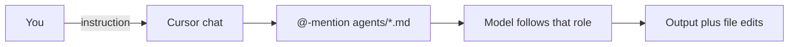
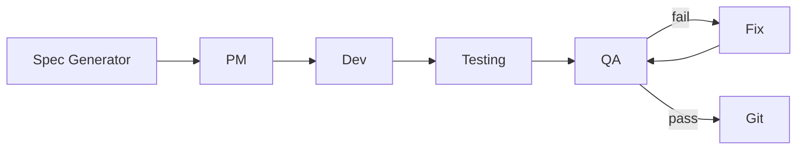
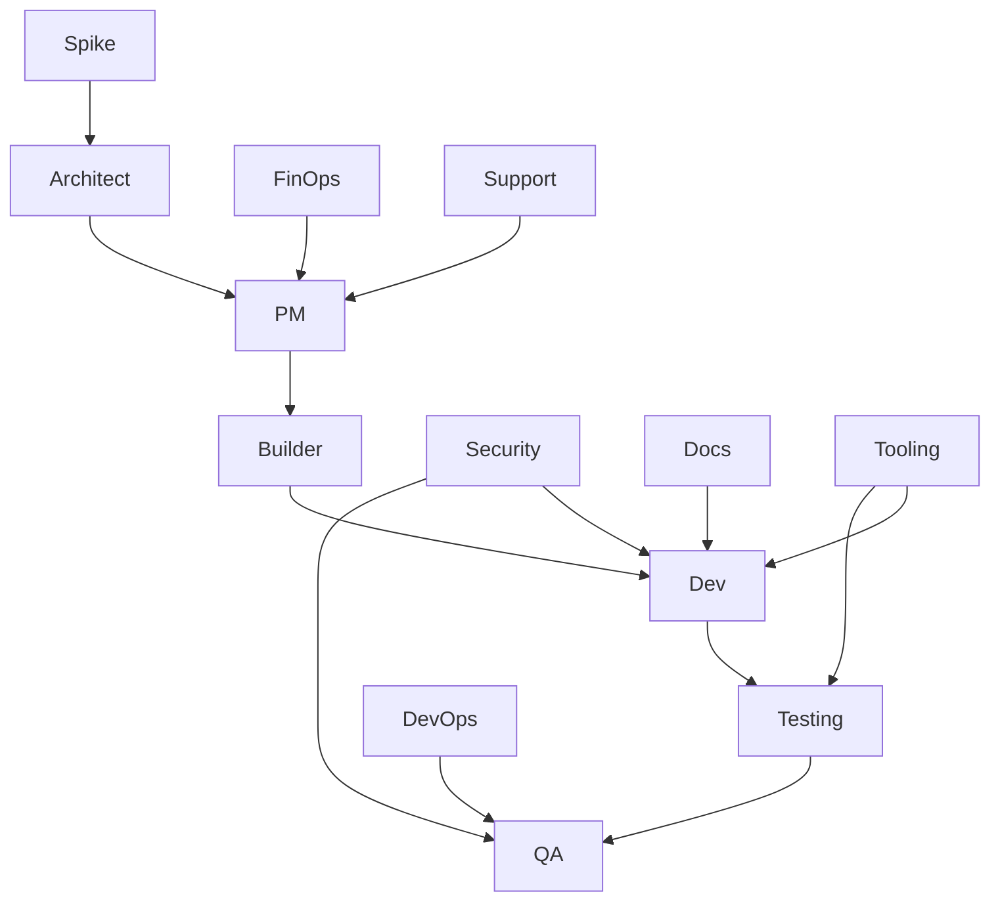

# WHICH AGENT DO I TALK TO?

There is **one** Cursor chat. You choose a **role** by `@`-mentioning the matching file and telling the model to follow it for this turn.

**Lean manufacturing (humans + agents):** see **`organizational_memory/LEAN-MANUFACTURING.md`** — value stream, WIP limits, quality at source, waste checklist, kaizen. Ask Cursor to apply it with `@organizational_memory/LEAN-MANUFACTURING.md` (e.g. "we have too much WIP—suggest concrete repo/process changes").

## How calling an agent works



Typical **chain** (same chat, new message each time—you re-`@` the next role):



**Testing** ( **`testing-agent.md`** ) sits between **Dev** and **QA** when you need the **test environment** (local/CI fixtures, env files, mocks) ready before running gates.

**Specialist stations** (Ford-line extras — `@` when needed; not every task uses every role):



## Quick router

| I want to… | `@` this file | Say something like… |
|------------|----------------|---------------------|
| Turn a spec into a **task list** (JSON, no code) | `agents/pm-agent.md` | "Act as PM Agent per this file. Output only the JSON task list for `specs/plumber-spec.md`." |
| **Implement** one task in the codebase | `agents/dev-agent.md` | "Act as Dev Agent. Task id `PLU-003` only. Branch `feature/PLU-003`." |
| **Test environments** (local/CI), fixtures, mocks, seeds, workflow test jobs | `agents/testing-agent.md` | "Act as Testing Agent. Align `.env.test`, docker compose test profile, and CI test job with task `PLU-003` so QA can run gates." |
| **Run / reason about** build, tests, acceptance | `agents/qa-agent.md` | "Act as QA Agent. Run `npm run build` / tests and report pass/fail JSON." |
| **Fix** failures QA reported (no new features) | `agents/fix-agent.md` | "Act as Fix Agent. Here are the errors: …" |
| **Commit / PR / git** steps | `agents/git-agent.md` | "Act as Git Agent. Commit with message …, push branch, draft PR body." |
| **Generate / expand** a full vertical **spec** | `agents/spec-generator-agent.md` | With `specs/_generated/<vertical>-SPEC-PROMPT.md` after `npm run generate-spec`, or "expand section 6 of `specs/plumber-spec.md`." |
| **Improve** the **spec markdown** | `agents/spec-generator-agent.md` | "Act as Spec Generator Agent. Update `specs/plumber-spec.md` with: …" |
| **System boundaries / ADRs** | `agents/architect-agent.md` | "Act as Architect Agent. Where should job-state live: instance vs package?" |
| **Threats, controls, HIPAA-style checklist** | `agents/security-agent.md` | "Act as Security Agent. Review this PHI flow before we implement." |
| **Deploy, rollback, CI/Vercel runbooks** | `agents/devops-agent.md` | "Act as DevOps Agent. Document rollback for plumber preview deploy." |
| **README, runbooks, operator docs** | `agents/docs-agent.md` | "Act as Docs Agent. Add a 'First run' section to README for plumber." |
| **QMS — controlled docs & lessons** | `agents/docs-agent.md` + `organizational_memory/QMS/inbox/*.md` | "Act as Docs Agent. Turn these inbox records into a `published/` controlled document + update `LESSONS-LEARNED.md` per `agents/docs-agent.md`." |
| **Tickets → FAQ → PM feedback** | `agents/support-agent.md` | "Act as Support Agent. Turn this transcript into triage + spec gaps." |
| **Scripts, generators, Cursor rules** | `agents/tooling-agent.md` | "Act as Tooling Agent. Add an npm script to validate task-queue JSON." |
| **Plans, Stripe, metering, entitlements** | `agents/finops-agent.md` | "Act as FinOps Agent. Propose seat vs location billing from the spec." |
| **Time-boxed unknown** (library, integration) | `agents/spike-agent.md` | "Act as Spike Agent, max 1h: can we use X for routing? Decision only." |
| **Bootstrap a new vertical app** (`apps/<id>-instance/`, configs, wiring) | `agents/builder-agent.md` | "Act as Builder Agent: scaffold `electrician-instance` from plumber pattern; no auto clone pipeline yet." |
| **Lean / flow / waste / WIP / kaizen** | `organizational_memory/LEAN-MANUFACTURING.md` | "Using LEAN-MANUFACTURING.md, review our process for: …" (normative doc; pair with Tooling/PM for changes.) File **Issues → Lean waste** (`lean issue` + **App / project bucket** → routes to that app's **GitHub Project** when configured — see **`organizational_memory/GITHUB-PROJECTS-SETUP.md`**). |

You can **@ more than one file** (e.g. `@specs/plumber-spec.md` + `@agents/pm-agent.md`).

## Phrase you can reuse

```text
For this message only, follow the role and rules in @agents/<FILE>.md.
My input: <paste lesson, error, or task>.
Do not switch to other roles unless I ask.
```

Use the exact filename: `pm-agent`, `builder-agent`, `dev-agent`, `testing-agent`, `qa-agent`, `fix-agent`, `git-agent`, `spec-generator-agent`, `architect-agent`, `security-agent`, `devops-agent`, `docs-agent`, `support-agent`, `tooling-agent`, `finops-agent`, `spike-agent`. For lean practices (not a code role), use **`@organizational_memory/LEAN-MANUFACTURING.md`**.

---

## PM Agent (`pm-agent.md`)

**Call when:** you need a **structured backlog** from a spec, not code.

**Example use cases**

- "Break `specs/plumber-spec.md` into tasks under 2 hours each, with `depends_on`."
- "We added a new MVP requirement—regenerate only the JSON for tasks that changed."
- "Validate that every section of the spec has at least one task id."

**Output:** JSON task list → paste into `factory/task-queue.json`.

---

## Builder Agent (`builder-agent.md`)

**Call when:** you are **adding a new vertical instance** (`apps/<vertical>-instance/`) or turning an empty shell into a first PR-ready skeleton — **not** for every feature (that's **Dev**).

**Example use cases**

- "Create `apps/electrician-instance/` mirroring `plumber-instance` + `vercel.json` + stub `index.html`; add `configs/electrician.json`."
- "List every file and workflow row needed so GitHub Project label `app:electrician-instance` works."
- "After skeleton exists, hand off first real tasks to PM → task-queue → Dev."

**Output:** checklist + minimal diffs; **no** claim of a fully automated clone/apply pipeline (see **`organizational_memory/ARCHITECTURE.md`** Builder section).

---

## Dev Agent (`dev-agent.md`)

**Call when:** you are implementing **one assigned task** in the repo.

**Example use cases**

- "Implement `PLU-005` in `apps/plumber-instance` only; branch `feature/PLU-005`."
- "Add the API route described in the task; do not refactor unrelated modules."
- "Lesson learned: always use this error shape—apply to the files you touched for this task."

**Output:** code changes + short summary of files touched.

---

## Testing Agent (`testing-agent.md`)

**Call when:** you need a **partner to Dev** who **owns all testing environments**: local and CI test configuration, fixtures, mocks/seeds, and which commands QA should run. **Not** the same as **QA** (which executes the gate and judges pass/fail).

**Example use cases**

- "Add `docker-compose.test.yml` + seed script so integration tests have Postgres + Redis."
- "Wire GitHub Actions test job to use `NODE_ENV=test` and documented secret names only."
- "Dev added Stripe webhooks—update MSW (or http mock) and golden payloads for CI."

**Output:** harness/config changes + a short **preconditions** block for **QA Agent**.

---

## QA Agent (`qa-agent.md`)

**Call when:** you want **verification** (build, tests, manual checks) against the codebase.

**Example use cases**

- "Run the test suite and report `{ status, errors }` per qa-agent."
- "Define a manual test checklist for the plumber job board from the spec."
- "Lesson learned: add a regression check for timezone on appointments."

**Output:** pass/fail style report; may suggest follow-up **Fix** work.

---

## Fix Agent (`fix-agent.md`)

**Call when:** QA (or CI) reported **specific failures** and you want fixes **without** scope creep.

**Example use cases**

- "These 3 test failures: fix only what's needed to pass."
- "Build fails with this stack trace—minimal patch."
- "Do not add the calendar feature; only resolve the type error."

**Output:** targeted patches; then call **QA** again.

---

## Git Agent (`git-agent.md`)

**Call when:** work is done and you want **version control hygiene** (commit message, branch, PR text).

**Example use cases**

- "Draft a conventional commit for the current diff; task id in the subject."
- "Write PR description linking to `PLU-003` and listing files changed."
- "Suggest branch name and rebase steps before merge."

**Output:** text for you to run in terminal / GitHub (or let Cursor apply if you approve).

---

## Spec Generator Agent (`spec-generator-agent.md`)

**Call when:** the **spec markdown** itself should be created, expanded, or corrected.

**Example use cases**

- "Turn `specs/_generated/plumber-SPEC-PROMPT.md` into a full `specs/plumber-spec.md`."
- "Add a 'Data retention' subsection under compliance for HIPAA."
- "Mark Phase 2 items clearly; tighten MVP acceptance bullets."

**Output:** updates under `specs/<vertical>-spec.md` (then consider **PM** again for task JSON).

---

## Architect Agent (`architect-agent.md`)

**Call when:** boundaries across `apps/*`, `packages/*`, or cross-cutting technical decisions.

**Example use cases** — "Where does auth session live for instances?" · "Draft an ADR for event sourcing vs CRUD for jobs." · "This change touches 3 packages—order the migrations." · "Should **electrician-instance** be **monorepo-integrated**, **HTTP-integrated** to core SaaS, or **standalone**?" · "Where do **frontend** bundles vs **backend** routes live for this vertical?"

**Output:** decision + consequences; optional ADR markdown path you provide.

---

## Security & Compliance Agent (`security-agent.md`)

**Call when:** threats, controls, secrets, PHI/PCI scope, dependency risk before or after implementation.

**Example use cases** — "Review OAuth callback flow." · "HIPAA minimum technical controls for audit log." · "Flag PII in logs for this PR diff."

**Output:** structured review + actionable checklist (not legal advice).

---

## DevOps / SRE Agent (`devops-agent.md`)

**Call when:** deploy, rollback, GitHub Actions, Vercel, env/secrets **names**, smoke checks after release.

**Example use cases** — "Write rollback steps for failed Vercel prod deploy." · "Suggest health check after merge to main."

**Output:** runbook + minimal workflow/config edits.

---

## Docs Agent (`docs-agent.md`)

**Call when:** onboarding, operator guides, README, API usage docs for humans — and when you need **QMS-inspired** outputs: **controlled procedures** under **`organizational_memory/QMS/published/`**, **document control** metadata, **Mermaid** process diagrams, and the rolling **`organizational_memory/QMS/LESSONS-LEARNED.md`** register from **`organizational_memory/QMS/inbox/`** records (see **`agents/agent-record-for-qms.md`**).

**Example use cases** — "Document `npm run factory` for new hires." · "Add troubleshooting for empty `task-queue.json`." · "Consolidate last sprint’s inbox files into one approved work instruction with revision history."

**Output:** markdown updates; **published** docs use **`organizational_memory/QMS/TEMPLATE-CONTROLLED-DOCUMENT.md`**; no invented flags without verifying repo; do **not** claim ISO certification unless the org truly has it.

---

## Support / CS Agent (`support-agent.md`)

**Call when:** customer voice: triage templates, FAQ, routing feedback to PM/spec.

**Example use cases** — "Turn these 5 tickets into FAQ + spec gaps." · "Classify: bug vs doc vs training."

**Output:** triage template + PM-ready bullets (redact PII).

---

## Tooling / DX Agent (`tooling-agent.md`)

**Call when:** factory ergonomics — scripts, templates, `.cursor` rules, `factory/*` helpers.

**Example use cases** — "Add JSON schema validation for `task-queue.json`." · "Normalize npm script names across README."

**Output:** small automation or checklist; avoid huge frameworks.

---

## FinOps / Billing Agent (`finops-agent.md`)

**Call when:** plans, Stripe objects, metering, dunning, entitlements vs spec.

**Example use cases** — "Map 'per location' pricing to Stripe Prices." · "List webhook idempotency risks."

**Output:** plan matrix + implementation sketch for `packages/billing` (not tax/legal advice).

---

## Spike / Research Agent (`spike-agent.md`)

**Call when:** unknown tech or integration **before** committing the line to full Dev work.

**Example use cases** — "2h spike: does library X support offline queue?" · "Feasibility of maps provider Y under our compliance note."

**Output:** proceed / caveats / stop + evidence; **no** production code unless you explicitly allow.

---

## Lessons learned (where to send them)

| Kind of lesson | Prefer |
|----------------|--------|
| New vertical folder / scaffold / "clone pattern" | `@agents/builder-agent.md` |
| How we build / code structure | `@agents/dev-agent.md` |
| Where code *should* live / platform shape | `@agents/architect-agent.md` |
| Scope, priorities, tasks, acceptance | `@agents/pm-agent.md` (often **after** spec edits via spec-generator) |
| Test **environments**, fixtures, CI test matrix, mocks | `@agents/testing-agent.md` |
| Tests, quality bar, regressions (run gates) | `@agents/qa-agent.md` |
| Only while fixing red CI/tests | `@agents/fix-agent.md` |
| Security / privacy / compliance (technical) | `@agents/security-agent.md` |
| Deploy / ops / incidents | `@agents/devops-agent.md` |
| How to run / explain the product | `@agents/docs-agent.md` |
| What customers hit in the field | `@agents/support-agent.md` |
| Repo scripts, generators, editor rules | `@agents/tooling-agent.md` |
| Pricing, plans, Stripe modeling | `@agents/finops-agent.md` |
| "Should we use X?" (time-boxed) | `@agents/spike-agent.md` |
| **QMS evidence → procedures / lessons** | Raw **`organizational_memory/QMS/inbox/`** per role, then **`@agents/docs-agent.md`** to curate **`published/`** + **`LESSONS-LEARNED.md`** |

---

## Optional: factory reminder

`npm run factory` prints a **runbook** per task (Dev → QA → Fix → Git). It does **not** open chat for you; use the router table to decide who to `@` for each step.
