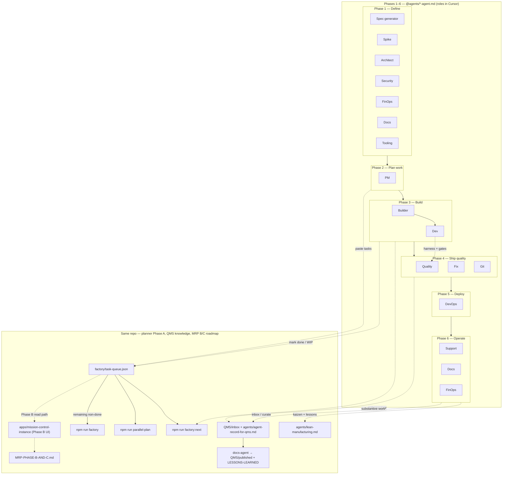
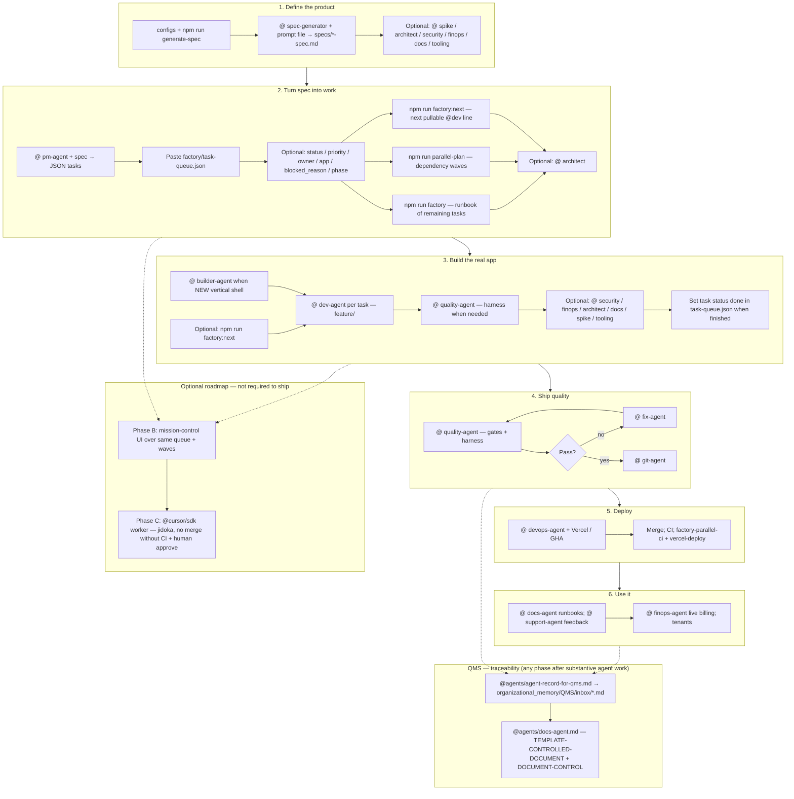

# SAAS FACTORY — END-TO-END PROCESS

This document is the **single walkthrough** from "idea for a vertical" to "deployed and in use," using this monorepo, **Cursor** (`@agents/*.md`), the **CLI**, and **GitHub / Vercel**. Example vertical: **plumber** — swap `plumber` / `plumber-instance` for dentist or another app.

**Architecture:** this factory uses **separate `apps/<vertical>-instance/` deployables** plus shared **`packages/*`** — not "one app, vertical = only JSON." See **`ARCHITECTURE.md`**.

> **Remember:** Scripts (`npm run …`) assemble files and CI; **they do not run Cursor agents** by default. You `@` agent markdown in chat when a human decision or code change is needed. See **`AGENTS.md`** for the router and copy-paste phrases. **`npm run factory:next`** suggests the next **Dev** task from the queue and prints optional **Quality** + **Dev** paste lines (deterministic planner); future **Phase B/C** (mission control UI + SDK runner) is described in **`MRP-PHASE-B-AND-C.md`**.

---

## All agents — where they participate

Every file under **`agents/*-agent.md`** is a **role** you invoke with `@agents/<filename>`. Normative **lean / WIP / waste** process lives in **`organizational_memory/LEAN-MANUFACTURING.md`** (`@organizational_memory/LEAN-MANUFACTURING.md`); **`agents/lean-manufacturing.md`** is a short pointer to that file.

| Agent file | Role in one line | Phases (see below) |
|------------|------------------|-------------------|
| **`spec-generator-agent.md`** | Writes / updates **spec markdown** from config + template | **1** (primary); spec edits anytime |
| **`spike-agent.md`** | Time-boxed **research** before committing the line | **1**, **3** (when unknowns block design or implementation) |
| **`architect-agent.md`** | **Boundaries**, ADRs, where code lives (`apps/*`, `packages/*`) | **1**, **2**, **3** |
| **`security-agent.md`** | **Threats & controls** (product-level; not legal advice) | **1**, **3**, **4** |
| **`finops-agent.md`** | **Plans, Stripe, metering**, entitlements vs spec | **1**, **3**, **6** |
| **`pm-agent.md`** | **Task JSON** from spec (`id`, `title`, `depends_on`) — no code | **2** (primary) |
| **`builder-agent.md`** | **New** `apps/<vertical>-instance/` skeleton + wiring checklist (no auto clone pipeline yet) | **2**–**3** (bootstrap); then **Dev** |
| **`dev-agent.md`** | **Implements one task**; branch `feature/<task-id>` | **3** (primary) |
| **`quality-agent.md`** | **Harness** (local/CI env, fixtures, mocks, seeds) **+ gates** (build, tests, acceptance) — **partner to Dev** | **3**–**4** (primary for verification) |
| **`tooling-agent.md`** | **Factory DX**: scripts, templates, `.cursor` rules, `factory/*` | **1–6** (whenever friction appears) |
| **`fix-agent.md`** | **Fix only** reported failures; no scope creep | **4** (loop with Quality) |
| **`git-agent.md`** | **Commits, branches, PR** text and hygiene | **4** → **5** |
| **`devops-agent.md`** | **Deploy, CI, Vercel**, rollback runbooks | **5** (primary) |
| **`docs-agent.md`** | **Operator / dev docs**, README, onboarding | **1**, **3**, **6** |
| **`support-agent.md`** | **Customer voice**: triage, FAQ → PM / spec | **6** (primary); feedback can reopen **1–2** |
| **Lean (normative doc)** | **Lean**: value stream, WIP, waste, kaizen | **Meta (1–6)**; GitHub **Lean waste** issues |

*Normative lean process:* **`@organizational_memory/LEAN-MANUFACTURING.md`** (not a `*-agent.md` file). **Phase C** (SDK worker) is summarized on **`MRP-PHASE-B-AND-C.md`** with **Phase B** (cockpit).

---

## Flow overview (core path + agents)

Details for **B**–**C** planner fields, **K** templates, and **R** trust ladder: **`MRP-PHASE-B-AND-C.md`** and **`QMS/README.md`**.

---

## 1. Define the product

| Step | What you do |
|------|-------------|
| 1.1 | Edit **`configs/plumber.json`** (summary, users, compliance, billing hints, MVP scope). |
| 1.2 | Run **`npm run generate-spec -- plumber`**. That writes **`specs/_generated/plumber-SPEC-PROMPT.md`**. |
| 1.3 | In Cursor: **`@specs/_generated/plumber-SPEC-PROMPT.md`** + **`@agents/spec-generator-agent.md`** → full **`specs/plumber-spec.md`**. |
| 1.4 | **You** review and approve before locking scope. |

### Agents in phase 1

| Agent | When to `@` |
|-------|----------------|
| **spec-generator** | Always for first full spec and later **spec markdown** changes. |
| **spike** | Unknown library, integration, or feasibility — **time-box** before writing lots of spec or code. |
| **architect** | Split **core-saas vs instance vs packages**; ADRs before the spec freezes the wrong shape. |
| **security** | HIPAA/PHI, auth flows, data classification — **early** so Quality/security later align. |
| **finops** | Billing model, Stripe shape, plans vs MVP in the spec. |
| **docs** | Seed **README / operator** notes as soon as the vertical name and run commands stabilize. |
| **tooling** | If spec/config generation or **issue templates** should change for this vertical. |
| **lean-manufacturing** | Process / WIP / waste discussion while defining scope (optional). |

---

## 2. Turn spec into work

| Step | What you do |
|------|-------------|
| 2.1 | **`@agents/pm-agent.md`** + **`@specs/plumber-spec.md`**. |
| 2.2 | Ask for **JSON only**: `id`, `title`, `depends_on` (atomic tasks, ~≤2h). Optionally add **`status`**, **`priority`**, **`owner`**, **`app`**, **`blocked_reason`** when you want the planner and waves to reflect real WIP (see **Task queue & MRP-style planner** below). |
| 2.3 | Paste into **`factory/task-queue.json`**. |
| 2.4 | Run **`npm run factory:next`** (or **`--json`**) to see the **next suggested Dev task** and paste-ready lines for **`@agents/dev-agent.md`** and **`@agents/quality-agent.md`**; use **`--wip`** or **`FACTORY_WIP_CAP`** to cap concurrent **`in_progress`** suggestions. |

### Agents in phase 2

| Agent | When to `@` |
|-------|----------------|
| **pm** | **Primary:** backlog JSON only (no implementation). |
| **architect** | If PM tasks should reflect a **migration** or cross-package ordering. |
| **finops** | If tasks must spell out **billing / webhook** milestones explicitly. |
| **tooling** | If you add **`npm run validate-queue`**, change **orchestrator** / **`factory:next`** behavior, or extend **task-queue** fields. |
| **docs** | Document how to **paste / merge** `task-queue.json` for new contributors. |
| **lean-manufacturing** | Right-size batches and WIP before dumping a huge task list. |

**CLI:** **`npm run parallel-plan`** (and **`--json`**) — dependency **waves** for parallelizable work (human or CI), not an LLM; tasks marked **`done`** are omitted from waves. **`npm run factory:next`** — **MRP-style** next task: honors **`status`**, **`depends_on`**, **`priority`**, and a **WIP cap** (`--wip` / `FACTORY_WIP_CAP`); prints suggested **`@agents/dev-agent.md`** and **`@agents/quality-agent.md`** lines (or **`--json`** with `devAgentInvocation` / `qualityAgentInvocation`). Sample queues: **`factory/examples/`**.

---

## Task queue & MRP-style planner (Phase A) and roadmap (B / C)

| Piece | What it is |
|-------|------------|
| **`factory/task-queue.json`** | Canonical list of tasks: **`id`**, **`title`**, optional **`depends_on`**, optional **`status`** (`backlog` · `ready` · `in_progress` · `blocked` · `done`), **`priority`**, **`blocked_reason`**, **`owner`**, **`app`**, optional **`phase`** (e.g. `"3"` / `"Phase 3"` for reporting). |
| **`npm run factory:next`** | Deterministic **“what should Dev pull next?”** — respects finished deps, WIP cap, and priority; does **not** invoke the model. |
| **`npm run parallel-plan`** | Structural **waves** among **non-done** tasks — same graph logic as the planner’s dependency world. |
| **`npm run factory`** | Runbook printout for remaining (non-done) tasks; still Cursor-native execution. |
| **`MRP-PHASE-B-AND-C.md`** | **Phase B:** `apps/mission-control-instance` as **control tower** (read queue / show waves / careful writes). **Phase C:** **`@cursor/sdk`** (or similar) **worker** with stop limits + **no merge without CI + human approve**. |
| **`QMS/README.md`** | **QMS-inspired** knowledge: agents write **`QMS/inbox/`** action records (**`agents/agent-record-for-qms.md`**); **Docs Agent** publishes **`QMS/published/`** controlled docs + **`QMS/LESSONS-LEARNED.md`** (diagrams, revision tables, ISO **themes** — not certification). |

Phases **B** and **C** are optional; **A** already gives you a literal planner box in software without agent autopilot.

---

## 3. Build the real app

| Step | What you do |
|------|-------------|
| 3.0 | Optional: **`npm run factory:next`** to confirm which **`feature/<task-id>`** branch aligns with the planner before you `@` Dev. |
| 3.1 | Implement in **`apps/plumber-instance/`**. |
| 3.2 | Shared code: **`packages/*`**, **`apps/core-saas/`** per architect boundaries. |
| 3.3 | Local dev server + click-through vs spec. |
| 3.4 | When work is finished for a task, set **`status`** to **`done`** in **`task-queue.json`** (or your PR bot flow later) so **`factory:next`** and **`parallel-plan`** treat the line correctly. |

### Agents in phase 3

| Agent | When to `@` |
|-------|----------------|
| **builder** | **New** vertical: scaffold **`apps/<vertical>-instance/`**, configs, GitHub/Vercel wiring checklist — **before** PM tasks if folder does not exist; there is **no** automated clone/apply script yet (**`ARCHITECTURE.md`**). |
| **dev** | **Primary:** **one task id**, branch **`feature/<task-id>`**, minimal blast radius. |
| **quality** | **Harness + gates:** local/CI **test environment**, fixtures, mocks, workflow jobs **and** build/tests / acceptance — **partner to Dev**. |
| **architect** | When implementation discovers **boundary** or tech-debt decisions. |
| **security** | Before merging sensitive paths (PHI, secrets, authz). |
| **finops** | While wiring **`packages/billing`** or plan changes. |
| **docs** | API / env / "how to run plumber locally" as you build. |
| **spike** | If you must **try** something before committing the Dev task. |
| **tooling** | Generators, scripts, **Cursor rules** that speed the next vertical. |

---

## 4. Ship quality

| Step | What you do |
|------|-------------|
| 4.1 | **`@agents/quality-agent.md`** — align harness when needed; `npm run build` / `npm test` when present; else checklist from agent. If failures are **missing services, bad env, or flaky fixtures**, iterate **Quality** on harness before assuming code defect. |
| 4.2 | **Pass?** → **`@agents/git-agent.md`**: commit, branch, PR (include **task id**). |
| 4.3 | **Fail?** → **`@agents/fix-agent.md`** with logs; **no new features**; loop to **Quality**. |

### Agents in phase 4

| Agent | When to `@` |
|-------|----------------|
| **quality** | **Primary:** harness + verification gate (build, tests, acceptance). |
| **fix** | **Only** on red tests / CI / concrete defects (after distinguishing harness vs code). |
| **git** | After green **Quality**: **commit message, PR body**, branch naming. |
| **security** | Quick **review** pass on PR diff for secrets / PII / authz regressions. |
| **docs** | Update **CHANGELOG**-style or operator notes for behavior that shipped. |
| **architect** | If **Quality** finds **systemic** coupling issues (optional follow-up tasks for PM). |

**Rule of thumb:** do not merge to **`main`** if CI is red (**stop the line**).

---

## 5. Deploy

| Track | What you do |
|-------|-------------|
| **A — Vercel** | Project for **`apps/plumber-instance`**; secrets per **`.github/workflows/vercel-deploy.yml`**. |
| **B — GitHub** | Merge PR → **`main`** → **`factory-parallel-ci.yml`**. |
| **Run** | **`vercel-deploy.yml`** (preview or `--prod`). |

### Agents in phase 5

| Agent | When to `@` |
|-------|----------------|
| **devops** | **Primary:** runbooks, rollback, workflow/env edits, smoke checks after deploy. |
| **git** | Release branch / tag strategy if you use them; PR merge messaging. |
| **security** | Prod **secrets**, headers, access model after first deploy. |
| **docs** | **Deploy URL**, env matrix (preview vs prod), on-call / who to ping. |
| **tooling** | CI/CD YAML quality-of-life (still meta, not business logic). |

---

## 6. Use it

| Step | What you do |
|------|-------------|
| 6.1 | Open **Vercel URL**; smoke critical paths. |
| 6.2 | Onboard users/tenants when **auth** + **billing** are real. |

### Agents in phase 6

| Agent | When to `@` |
|-------|----------------|
| **support** | **Primary:** triage templates, FAQ, **feedback bullets** for PM/spec. |
| **docs** | Customer-facing **help**, admin runbooks, incident "first 5 minutes". |
| **finops** | Live **usage vs plan**, dunning, Stripe anomalies. |
| **pm** + **spec-generator** | When support proves **spec gaps** — update spec then **regenerate or adjust tasks**. |
| **lean-manufacturing** | Steady-state **kaizen**; file **Lean waste** GitHub issues (`lean issue` + app bucket). |

---

## Related factory mechanics

| Topic | Where |
|-------|--------|
| **Architecture** — separate `apps/*-instance` + `packages/*`, **frontend/backend placement**, **integration modes** (monorepo / HTTP / standalone), **CI workflow** notes | **`ARCHITECTURE.md`** |
| **Mission control** — where PM items live besides Issues, VSM "you are here", agent log | **`MISSION-CONTROL.md`**, **`AGENT-RUN-LOG.md`** |
| **MRP UI + orchestrated runner roadmap** (Phases B & C) | **`MRP-PHASE-B-AND-C.md`** |
| **QMS-style knowledge** (inbox → published, lessons, ISO-theme map) | **`QMS/README.md`**, **`agents/agent-record-for-qms.md`**, **`agents/docs-agent.md`** |
| Router + use cases per agent | **`AGENTS.md`** |
| Lean / WIP / waste / GitHub issues & projects | **`LEAN-MANUFACTURING.md`**, **`GITHUB-PROJECTS-SETUP.md`** |
| Slash commands | **`.cursor/commands/`** |
| Global Cursor rules | **`.cursor/rules/saas-factory.mdc`** |

---

## Changelog (keep this doc honest)

| Date | Change |
|------|--------|
| 2026-05-04 | Six-phase plumber walkthrough; **all** `agents/*-agent.md` + lean doc in master table, per-phase "Agents in phase N" tables, and two Mermaid overviews (roles-by-phase + core path with `@` hints). |
| 2026-05-04 | Linked **MISSION-CONTROL** + **`AGENT-RUN-LOG.md`** for PM sources-of-truth vs Issues and manual agent audit trail. |
| 2026-05-04 | Documented architecture choice: **separate `apps/*-instance` + `packages/*`**; not config-only single app. |
| 2026-05-04 | **Builder agent** (`agents/builder-agent.md`): vertical bootstrap without pretending there is an auto clone pipeline; ARCHITECTURE Builder section; README / FACTORY-PROCESS / AGENTS / cursor rules updated. |
| 2026-05-04 | **organizational_memory:** all factory documentation consolidated under **`organizational_memory/`**; this file and cross-links live there. |
| 2026-05-04 | **Phase A planner:** optional **`status`**, **`priority`**, **`owner`**, **`app`**, **`blocked_reason`** on `factory/task-queue.json`; **`npm run factory:next`**; `done` tasks excluded from **`parallel-plan`** waves; sample queues under **`factory/examples/`**. |
| 2026-05-04 | **FACTORY-PROCESS** refresh: new section **Task queue & MRP-style planner (Phase A) and roadmap (B / C)**; phases **2–3** steps + flow Mermaid include **`factory:next`** and marking **`done`**; **Related** links + **`MRP-PHASE-B-AND-C.md`**; relative links to sibling docs in **`organizational_memory/`**. |
| 2026-05-04 | **QMS-inspired knowledge:** **`QMS/`** tree (`inbox/`, `published/`, templates, **`LESSONS-LEARNED.md`**, **`ISO-ALIGNMENT.md`**); all **`agents/*-agent.md`** + **`agents/agent-record-for-qms.md`** require raw action records after substantive work; **Docs Agent** curates ISO-style controlled documents; **AGENTS**, **MISSION-CONTROL**, **saas-factory.mdc** updated. |
| 2026-05-04 | **Mermaid refresh:** phase diagram adds **Phase A** queue / **`factory:next`** / **`parallel-plan`** / **`factory`** runbook, **QMS** path, **lean-manufacturing** stub + org **`LEAN-MANUFACTURING.md`**, **mission-control** + **`MRP-PHASE-B-AND-C.md`**; core flow adds full planner CLI chain, **`task-queue.json`** **done** step, **`factory-parallel-ci`**, QMS subgraph (**agent-record-for-qms** → inbox → **docs-agent** templates), optional **Phase B/C** roadmap subgraph. |
| 2026-05-04 | Renamed **`agents/AGENT-RECORD-FOR-QMS.md`** → **`agents/agent-record-for-qms.md`** and **`agents/LEAN-MANUFACTURING.md`** → **`agents/lean-manufacturing.md`**; links and diagrams updated. |
| 2026-05-04 | Added **`agents/testing-agent.md`** — **partner to Dev**, owns **test environments** (local/CI, fixtures, mocks); **AGENTS** chain Dev→Testing→QA; **FACTORY-PROCESS** tables + Mermaid + phase **3/4** steps; factory runbook + **`factory:next`** JSON hint. |
| 2026-05-05 | Merged **Testing** + **QA** into **`agents/quality-agent.md`**; **`testing-agent.md`** / **`qa-agent.md`** are redirects; **`factory:next`** JSON uses **`qualityAgentInvocation`**; runbook **Dev → Quality → Fix → Git**. |
| 2026-05-04 | **`ARCHITECTURE.md`**: **frontend vs backend** placement, **integration modes** (monorepo-integrated / HTTP-integrated / standalone), **CI & workflow** implications; **Related** row updated; **Architect**, **Builder**, **Dev**, **DevOps**, **Tooling** agents + workflow YAML comments aligned. |

When the process changes (new scripts, new agents, new CI), **update this table and the sections above** in the same PR.
