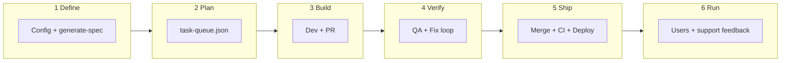

# MISSION CONTROL — WHERE WORK LIVES & WHERE WE ARE

This is your **single dashboard-style view**: sources of truth for PM-style work, how to **log agent runs** (Cursor is manual unless you add SDK), and a **value stream map (VSM)** you edit to show current phase.

> GitHub Issues/Projects are **not** the only place PM items exist. See **Sources of truth** below.

---

## Sources of truth (where PM / project items live)

| Layer | What lives there | Who updates it |
|-------|------------------|----------------|
| **Spec** | `specs/<vertical>-spec.md` | Spec Generator + you (approve) |
| **Task queue (machine-readable)** | `factory/task-queue.json` | PM agent output → you paste/merge |
| **Parallel plan** | `npm run parallel-plan -- --json` → artifact in CI, or run locally | CLI / CI |
| **GitHub Issues** | Bugs, lean waste, per-app work (`app:*` labels) | Humans + templates |
| **GitHub Projects** | One board per app (see `GITHUB-PROJECTS-SETUP.md`) | Automation + you |
| **Branches / PRs** | `feature/<task-id>` | Dev + Git agents |
| **Process doc** | `FACTORY-PROCESS.md` (this folder) | You, when the lifecycle changes |
| **QMS records & controlled docs** | `QMS/inbox/` (raw per-role action records), `QMS/published/` (Docs Agent curated), `QMS/LESSONS-LEARNED.md` | Each agent after work; **Docs Agent** for ISO-style consolidation |
| **Deployable shell (future UI)** | `apps/mission-control-instance/` — same **static placeholder** pattern as `apps/plumber-instance/` (not a built dashboard yet) | You / Dev agent when you implement the real app |

There is **no hidden database** in this repo for "PM only" besides the files above and GitHub.

---

## Agent run log (did the agent finish the feature?)

**Cursor does not write here automatically.** After a chat session where you used an `@agents/*` role, append **one line** (or block) to:

### → **`AGENT-RUN-LOG.md`** (this folder)

That file is the **append-only mission log**: date, agent, task id, outcome (done / blocked / partial), and link to PR or issue if any. For **structured evidence** (actions, lessons, handoff) used in QMS-style docs, use **`QMS/inbox/`** per **`agents/agent-record-for-qms.md`**.

Optional later upgrades (not in repo yet):

- `@cursor/sdk` or a hook to append from tooling.
- GitHub Actions commenting on issues when CI passes (still not "agent ran," but "build verified").

---

## VSM — value stream map (edit the "You are here" line)

Copy the phase line into **Current position** whenever you move the factory forward.

### Current position (human-maintained)

**You are here:** _Phase __ · Vertical: __ · Active task id(s): ___

### Stream (left → right = time)

### Quick health check (tick in PR or daily standup)

| Gate | Check |
|------|--------|
| Spec approved? | `specs/*-spec.md` reviewed |
| Tasks in queue? | `factory/task-queue.json` non-empty & ordered |
| WIP sane? | Few open `feature/*` branches vs your WIP limit |
| CI | Latest `main` workflow green |
| Deploy | Vercel preview/prod URL known |

---

## Links

| Need | File |
|------|------|
| **Architecture** (instances + packages, not config-only monolith) | **`ARCHITECTURE.md`** |
| Full lifecycle + all agents | **`FACTORY-PROCESS.md`** |
| Which `@` agent when | **`AGENTS.md`** |
| Lean / waste issues | **`LEAN-MANUFACTURING.md`** |
| GitHub Projects per app | **`GITHUB-PROJECTS-SETUP.md`** |
| QMS-style records & controlled docs | **`QMS/README.md`**, **`QMS/LESSONS-LEARNED.md`** |

---

## Changelog

| Date | Change |
|------|--------|
| 2026-05-04 | Introduced mission control dashboard, source-of-truth table, VSM block, pointer to agent run log. |
| 2026-05-04 | Added **`apps/mission-control-instance/`** placeholder app (plumber-style static shell) + Vercel / GitHub Project wiring for `app:mission-control-instance`. |
| 2026-05-04 | Linked **ARCHITECTURE** (repo commits to separate `apps/*-instance` + `packages/*`). |
| 2026-05-04 | Documentation consolidated under **`organizational_memory/`**; agent log path updated here. |
| 2026-05-04 | **QMS** row in sources of truth; pointer to **`QMS/inbox/`** vs **`AGENT-RUN-LOG.md`**. |
