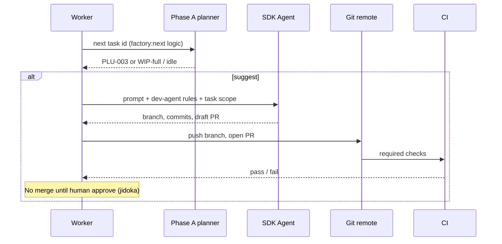

# MRP COCKPIT (PHASE B) AND ORCHESTRATED RUNNER (PHASE C)

This document explains **two optional upgrades** after **Phase A** (the deterministic planner: `factory/task-queue.json` fields, `npm run factory:next`, `computeParallelBatches` — see **[FACTORY-PROCESS.md](FACTORY-PROCESS.md)**). Phase A is **planning only**. Phases B and C add a **single screen** (control tower) and optionally **automated execution**—still with human-centered controls (jidoka).

---

## How the pieces fit together

| Phase | Role | Analogy to classic MRP / VSM |
|-------|------|-------------------------------|
| **A** (today) | `factory:next` + status on the queue | **Planner**: “what job is next?” |
| **B** | Mission control app | **Cockpit / boards**: see WIP, waves, blockers in one place |
| **C** | Worker + `@cursor/sdk` | **Dispatch signals to cells**: agent runs the job; humans keep stop-the-line authority |

Phase B can ship **without** Phase C. Phase C assumes Phase A (and usually benefits from Phase B for visibility).

---

## Phase B — Mission control as the MRP UI

**Goal:** Turn `apps/mission-control-instance` into a **thin control tower**: one place to read the same truth the planner uses, without replacing GitHub Issues or the repo as the system of record.

### Read path (where the UI gets data)

You need **`factory/task-queue.json`** (and optionally spec links, CI badges, etc.) in the browser. Typical options:

1. **GitHub Contents API** — fetch `task-queue.json` from `main` (or a chosen ref). Pros: always matches remote; no backend secret for read-only public repos. Cons: rate limits; private repos need a token (server-side or scoped client pattern).

2. **Small API route** — a minimal backend (e.g. Vercel serverless, or same-repo BFF) that reads a configured path or proxies GitHub. Pros: can hide tokens, cache, validate JSON. Cons: deploy + env.

3. **Static build step** — at build time, copy or embed the queue into the static site. Pros: simplest hosting. Cons: stale until redeploy; not live “shop floor.”

For a **true** MRP board, (1) or (2) is more honest than (3) alone; you can combine (3) for demos and (1) for real use.

### Show waves (same brain as the CLI)

Reuse **`computeParallelBatches`** from `factory/task-graph.ts`:

- Either **compile** the factory package into something the front end can import (monorepo shared package), or
- Expose a **tiny HTTP handler** that runs the same TypeScript on the server and returns `{ waves, waveCount, maxParallelism }` (same shape as `npm run parallel-plan -- --json`).

The UI then renders **waves** as rows or swimlanes: “these ids could run in parallel if capacity allows.” That matches the VSM idea of parallel stations **without** claiming agents ran.

### Write path (changing status — trust ladder)

The queue file in git is the **authoritative** schedule for Phase A. The UI can:

1. **Copy JSON** — user edits locally and opens a PR (zero trust, zero secrets). Good for v1.

2. **PR bot** — user clicks “Mark PLU-003 done” in UI; bot opens a PR that only touches `task-queue.json` (or a dedicated state file). Humans merge; CI runs. **Still jidoka**: bad JSON fails CI.

3. **Full auto-write** — UI commits directly to `main`. Requires strong auth, audit log, and team trust—usually later.

Start with (1) or (2). Phase B remains valuable as **read-only + copy instructions** even before any write automation.

### What “good” looks like for Phase B

- Single page: **next suggested task** (call `factory:next` logic server-side or duplicate the small algorithm in shared code—**one implementation** is ideal).
- Tables: **in progress**, **blocked** (show `blocked_reason`), **done** counts, WIP vs cap.
- Links out: GitHub Actions, PR list filtered by `feature/<task-id>`, optional GitHub Project for the app bucket.

That is the **MRP cockpit**: visibility + pull signals; the “engine” stays Phase A’s rules.

---

## Phase C — Orchestrated agent runner (execution, not just planning)

**Goal:** A **worker** (long-running process on a dev machine, or a **GitHub Action** on a runner with Cursor / SDK access) can **execute** a dev cycle for one task id, using the same standards as a human in chat.

**Stack in mind:** **`@cursor/sdk`** (or an equivalent “run agent with repo context” API). Exact APIs evolve; treat the SDK docs as source of truth when you implement.

### Control loop (high level)

### Step 1 — Ask the planner

Run the same logic as **`npm run factory:next`** (import `planNext` from `factory/planner.ts` after exporting it if needed, or shell out to `npm run factory:next -- --json`). Respect **WIP cap** and **dependency-done** semantics so the worker does not starve or overload the line.

### Step 2 — Start the agent with a fixed prompt

Bundle a **deterministic** system/user prompt, for example:

- Task id, title, acceptance pointers from `task-queue.json` / spec excerpt.
- Instruction: follow **`agents/dev-agent.md`** (inline summary or “read this path in repo” if the runtime can load files).
- Hard constraints: **one branch** `feature/<task-id>`, **no scope** outside files touched for that task, link PR title to task id.

This is **automated dispatch to a cell** (Dev), not a free-form chat.

### Step 3 — Stop conditions (non-negotiable for safety)

Configure limits so the worker cannot run forever or silently burn budget:

- **Max turns** or **max tool rounds** per task attempt.
- **Max wall time** per run.
- **Max cost** (if the provider exposes metering)—stop and leave branch + log.

On failure: leave the repo in a **known state** (branch pushed, comment on PR “agent stopped: limit X”), do not merge.

### Step 4 — Jidoka: CI green + human merge

Treat automated runs as **assist**, not **authority**:

- **Required status checks** on the PR (typecheck, tests, factory scripts you care about).
- **No auto-merge to `main`** until a human approves (or a second, explicit “release manager” gate if policy allows later).

That preserves **stop the line**: red CI means the worker does not get a merge; humans fix or reject.

### Where this runs

| Environment | Pros | Cons |
|-------------|------|------|
| **Local daemon** | Secrets on your machine; fast iteration | Machine must be on |
| **GitHub Action + hosted runner** | Centralized; repeatable | Cursor/SDK on CI must be supported; token hygiene; cost |

Many teams start **local** or **manual trigger** (`workflow_dispatch`) before unattended schedules.

### Relationship to Phase B

Phase C generates **noise** (branches, PRs, logs). Phase B is where operators see **WIP**, **waves**, and **blockers** in one place—so Phase B is the natural **dashboard for Phase C**.

---

## Summary

- **Phase B** = **read** (and later **carefully write**) the queue + show **waves** and planner output in **`mission-control-instance`** — the **MRP UI**.
- **Phase C** = **worker + `@cursor/sdk`** implements **dispatch** to a Dev-style agent with **hard stop conditions** and **human merge** — **automated cells**, not unsupervised production.

Both phases keep the **planner honest** (Phase A) and **quality at the source** (CI + human jidoka).

---

## Changelog

| Date | Change |
|------|--------|
| 2026-05-04 | Initial doc: Phase B mission control UI + Phase C orchestrated agent runner, aligned with existing factory planner and lean language. |
