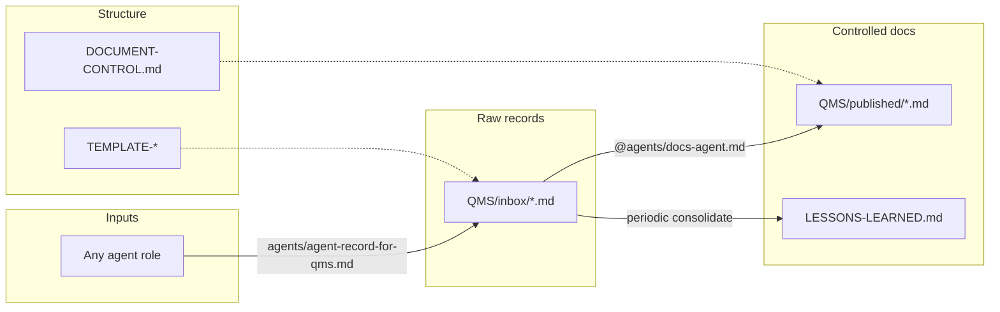

# QUALITY MANAGEMENT STYLE DOCUMENTATION (QMS-INSPIRED)

This folder holds **records** and **controlled documentation** in the spirit of ISO 9001-style quality systems: **traceable actions**, **lessons learned**, **approved practices**, and **diagrams** — without claiming external certification.

## Flow

1. **Agents** perform work → each writes a raw **Agent action record** in **`inbox/`** (see **`agents/agent-record-for-qms.md`**).
2. **Docs Agent** transforms selected inbox items into **controlled documents** in **`published/`** using **`TEMPLATE-CONTROLLED-DOCUMENT.md`** and **`DOCUMENT-CONTROL.md`**.
3. **`LESSONS-LEARNED.md`** is the rolling register of **cross-cutting** lessons and best practices (Docs Agent merges duplicates, adds categories).

## Folders

| Path | Purpose |
|------|---------|
| **`inbox/`** | Raw agent action records (append-only style; do not rewrite others’ files). |
| **`published/`** | Curated procedures, work instructions, and summaries suitable for onboarding / audits of process. |
| **`TEMPLATE-*.md`** | Copy patterns for humans and agents. |
| **`ISO-ALIGNMENT.md`** | How repo artifacts map to familiar ISO 9001 **themes** (informative only). |

## IV&V-style controlled procedures (SE V-model parity)

Optional **standalone** procedures under **`published/`** mirror classic verification / validation planning levels while staying SaaS Factory–specific (agents, specs, CI). Registry: **`DOCUMENT-CONTROL.md`**.

| Doc ID | Title |
|--------|--------|
| **QMS-PUB-001** | [System Validation Strategy](published/QMS-PUB-001-system-validation-strategy.md) |
| **QMS-PUB-002** | [System Verification Plan (System Acceptance)](published/QMS-PUB-002-system-verification-plan.md) |
| **QMS-PUB-003** | [Subsystem Verification Plan (Subsystem Acceptance)](published/QMS-PUB-003-subsystem-verification-plan.md) |
| **QMS-PUB-004** | [Unit & Device Test Plan](published/QMS-PUB-004-unit-device-test-plan.md) |

## Who does what

| Role | Responsibility |
|------|------------------|
| **Each specialist agent** | Write factual **`inbox/`** record when work was performed. |
| **Docs Agent** | Normalize voice, add document control blocks, merge lessons, add diagrams, split/merge files under **`published/`**. |

## See also

- **`agents/docs-agent.md`** — formatting rules and anti-patterns for QMS output.
- **`organizational_memory/AGENT-RUN-LOG.md`** — optional lightweight session log.
