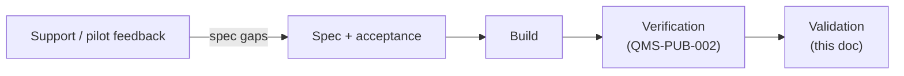

# System Validation Strategy

## Document control

| Field | Value |
|-------|--------|
| **Document ID** | QMS-PUB-001 |
| **Revision** | 0.1 |
| **Status** | Draft |
| **Owner (role)** | Docs / Product (with PM) |
| **Source records** | `organizational_memory/QMS/inbox/2026-05-06-docs-ivv-published-suite.md` |
| **Applicable roles** | Spec Generator, PM, Quality, Support, DevOps |
| **Review due** | n/a |

## Purpose & scope

This controlled document defines **system validation** for SaaS Factory verticals: evidence that the delivered software **meets stakeholder intent and operational needs**, not only that it passes technical checks (that is **verification** — see QMS-PUB-002).

**In scope:** validation planning, acceptance criteria linkage, operational readiness signals, and handoff from field/support feedback back into specs.

**Out of scope:** formal regulatory certification, customer contracts not reflected in repo specs, and subsystem- or unit-level test plans (see QMS-PUB-003, QMS-PUB-004).

## References

- `specs/<vertical>-spec.md` — acceptance-oriented requirements and MVP bullets
- `organizational_memory/AGENTS.md` — Support → PM / Spec Generator routing
- `organizational_memory/ARCHITECTURE.md` — integration modes and contracts
- QMS-PUB-002 — System Verification Plan (technical acceptance gates)

## Strategy & procedure

1. **Baseline intent** — Each releasable increment ties to a **spec** and, where used, **task ids** in `factory/task-queue.json` so scope is traceable.
2. **Validation criteria** — Pull acceptance language from the spec (user journeys, compliance notes, NFRs). If missing, Spec Generator + PM add explicit **validation / acceptance** bullets before calling a release “validated.”
3. **Evidence types** (use what applies; minimum is documented choice):
   - Structured **acceptance checklist** (Quality or PM maintains per vertical or per epic).
   - **Support / CS triage** (`agents/support-agent.md`) confirming resolved issues match spec intent.
   - **Smoke / pilot** on preview or staging with documented sign-off (issue comment or controlled appendix).
4. **Operational readiness** — DevOps runbooks (deploy, rollback, env naming) exist or are updated for the release; see `agents/devops-agent.md`.
5. **Gap handling** — Misalignment between field feedback and spec is routed to **PM → Spec Generator**, not patched only in chat.

## Diagram (informative)

## Lessons learned & best practices

- Treat **validation** and **verification** as distinct gates; green CI alone is not validation.
- **Proven:** Trace releases to task ids and spec sections for audit-friendly narrative.

## Revision history

| Rev | Date | Author | Summary |
|-----|------|--------|---------|
| 0.1 | 2026-05-06 | Docs | Initial publish — SE V-model parity (system validation strategy) |
