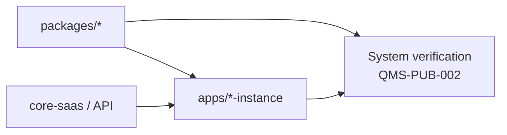

# Subsystem Verification Plan (Subsystem Acceptance)

## Document control

| Field | Value |
|-------|--------|
| **Document ID** | QMS-PUB-003 |
| **Revision** | 0.1 |
| **Status** | Draft |
| **Owner (role)** | Architect (with Quality / Dev) |
| **Source records** | `organizational_memory/QMS/inbox/2026-05-06-docs-ivv-published-suite.md` |
| **Applicable roles** | Architect, Dev, Quality, Security |
| **Review due** | n/a |

## Purpose & scope

This plan covers **subsystem-level verification**: shared **`packages/*`**, individual **`apps/<vertical>-instance/`**, and **`apps/core-saas/`** as bounded elements that integrate into a system. Goal is **subsystem acceptance** before full system verification (QMS-PUB-002) claims the integrated whole.

**In scope:** boundaries per `organizational_memory/ARCHITECTURE.md`, contracts across monorepo-integrated vs HTTP-integrated modes, and targeted tests or checks at package/app granularity.

**Out of scope:** enterprise-wide architecture boards external to this repo; replace with ADRs and specs when decisions land here.

## References

- `organizational_memory/ARCHITECTURE.md` — integration modes, env var contracts
- `agents/architect-agent.md` — boundary decisions and ADRs
- `agents/security-agent.md` — subsystem-level threat reviews when data crosses boundaries
- QMS-PUB-002 — system verification consolidation
- QMS-PUB-004 — unit/device level

## Subsystems (informative inventory)

| Subsystem class | Typical location | Verification emphasis |
|-----------------|------------------|------------------------|
| Shared libraries | `packages/*` | Package-level tests, API stability |
| Vertical surface | `apps/*-instance/` | Vertical routes/UI/server behavior |
| Core reference / API | `apps/core-saas/` | Contract tests when HTTP-integrated |

## Procedure

1. **Name the boundary** — Architect (or Dev with Architect review) documents the subsystem under change: imports, HTTP endpoints, env vars **names**, auth model.
2. **Define acceptance for that subsystem** — Minimal: automated tests where they exist; plus manual checklist slice if Quality maintains one for that package/app.
3. **Contract checks** — For HTTP-integrated mode, verify versioning/breaking-change notes align with consumers; Security reviews cross-boundary data classification when relevant.
4. **Integrate** — After subsystem acceptance, fold changes into **system verification** (QMS-PUB-002) so CI covers affected workspace projects (matrix per ARCHITECTURE).
5. **Record** — Link PRs to task ids and any ADR path for boundary changes.

## Diagram (informative)

## Lessons learned & best practices

- **Proven:** Undocumented boundaries cause duplicate verification or gaps; prefer short ADRs over tribal knowledge.
- Subsystem verification **feeds** system verification; avoid skipping consolidated gates after package-only green tests.

## Revision history

| Rev | Date | Author | Summary |
|-----|------|--------|---------|
| 0.1 | 2026-05-06 | Docs | Initial publish — SE V-model parity (subsystem verification / acceptance) |
