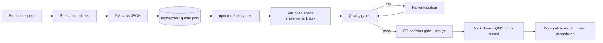

# Factory delivery loop procedure (standard work)

## Document control
| Field | Value |
|-------|--------|
| **Document ID** | QMS-PUB-007 |
| **Revision** | 0.1 |
| **Status** | Draft |
| **Owner (role)** | Docs |
| **Source records** | `organizational_memory/QMS/inbox/2026-05-09-tooling-factory-platform-hardening.md`, `organizational_memory/QMS/inbox/2026-05-09-docs-first-loop-standard-work.md`, `organizational_memory/QMS/inbox/2026-05-09-docs-qms-pub-005-close-loop.md` |
| **Applicable roles** | PM, Dev, Quality, Fix, Git, DevOps, Docs, Tooling |
| **Review due** | n/a |

## Purpose & scope

This procedure defines the **repeatable delivery loop** for work executed via the SaaS Factory:

- From **task request** → **task queue** → **implementation** → **verification gates** → **merge** → **closure** (task + evidence).

Out of scope:

- Vertical-specific product procedures (see vertical specs under `specs/`).
- Deployment runbooks (owned by DevOps; referenced here but not duplicated).

## References

- Router and role entry points: `organizational_memory/AGENTS.md`
- End-to-end walkthrough: `organizational_memory/FACTORY-PROCESS.md`
- Canonical work inventory: `factory/task-queue.json`
- Planner / next-task suggestion: `npm run factory:next`
- Parallel waves: `npm run parallel-plan`
- QMS inbox record template: `agents/agent-record-for-qms.md`
- Decision gate: `organizational_memory/QMS/published/QMS-PUB-005-pull-request-decision-gate.md`
- Factory CI workflow: `.github/workflows/factory-parallel-ci.yml`

## Procedure / work instruction

### 0) Preconditions (always)

- Work is traceable to a **task id** in `factory/task-queue.json` (or you are explicitly doing `n/a` scoped tooling/docs work).
- `npm run validate-task-queue` passes on the branch before merging.

### 1) Define or refine requirements (Spec Generator / Architect / PM as needed)

- If a spec is missing or outdated:
  - Use `@agents/spec-generator-agent.md` to create/update the spec under `specs/`.
  - Use `@agents/architect-agent.md` if boundaries / integration mode decisions are required.
- Convert spec scope into tasks:
  - Use `@agents/pm-agent.md` to produce **JSON-only tasks** and merge into `factory/task-queue.json`.

### 2) Pull the next unit of work (Planner)

- Run `npm run factory:next` (optionally `--queue=...`) to get the **next pullable task**.
- Respect WIP limits:
  - WIP is tracked via tasks with `status: "in_progress"`; the planner will stop when cap is reached.

### 3) Implement one task (Dev / Tooling / Docs / DevOps — per `assigned_agent`)

- Follow the `factory:next` **Next agent line** (role-aware).
- Keep scope bounded to the single task id.
- Record what changed (paths) and the commands you ran.

### 4) Verification and gates (Quality → Fix loop)

- Quality runs gates and produces a structured pass/fail outcome.
- If gates fail:
  - Hand off to Fix for remediation only.
  - Re-run Quality gates after fixes.

Minimum recommended gate commands (project-dependent):

- `npm run check`
- `npm run validate-task-queue`
- `npm run validate-agent-registry`
- `npm run validate-workflow-machine`
- Fixture harnesses when present:
  - `npm run validate-task-queue-fixtures`
  - `npm run validate-agent-output-fixtures`
  - `npm run validate-qms-inbox`
  - `npm run validate-qms-inbox-fixtures`

### 5) Git decision gate (PR)

- Open a PR with the task id in the title/body.
- Ensure CI is green and evidence artifacts are present (see `.github/workflows/factory-parallel-ci.yml`).
- Merge only after the PR decision gate checklist is satisfied (QMS-PUB-005).

### 6) Closure (task queue + QMS evidence)

Closure is **not complete** until both are true:

1. The task is marked **`status: "done"`** in `factory/task-queue.json` (and per-app queues are synced if used).
2. Substantive work has a QMS inbox record under `organizational_memory/QMS/inbox/` per `agents/agent-record-for-qms.md`.

## Diagrams (optional)

## Lessons learned & best practices

- **Proven**: Keep work atomic (one task id per implementation turn) and let the planner pull the next unit.
- **Proven**: Quality owns harness and gates; use fixture harnesses to make validations deterministic.
- **Proven**: Close the loop after merge: `status: "done"` + QMS inbox evidence prevents stale planning suggestions.

## Revision history
| Rev | Date | Author | Summary |
|-----|------|--------|---------|
| 0.1 | 2026-05-09 | Docs Agent | Initial publish of factory delivery loop procedure |

