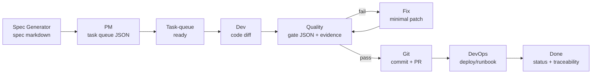

# Factory Design Spec (Meta-Spec): SaaS Factory System Blueprint

## 1) Purpose and scope
**Purpose:** Define the SaaS Factory system as a deterministic, auditable workflow for turning specs into shipped code across multiple vertical apps, using role-specialized agents and explicit gates.

**This spec covers:**
- The factory’s **domain model** (tasks, agents, gates, artifacts, evidence, QMS records)
- The factory’s **workflows** (Spec → PM → Dev → Quality ↔ Fix → Git → DevOps)
- **System boundaries and contracts** (schemas, queue contract, outputs)
- **NFRs** that the factory itself must satisfy (traceability, reproducibility, minimal WIP, auditability)
- **MVP vs Phase 2** roadmap for factory capabilities

**This spec does not cover:** Any single vertical product requirements (see `specs/<vertical>-spec.md` for those).

---

## 2) Guiding principles (determinism-first)
- **Deterministic handoffs**: Each role produces an artifact with a stable, validate-able shape (schema-backed where applicable).
- **Bounded responsibility**: Each agent role has explicit allowed outputs and forbidden actions; “do less, but reliably.”
- **Quality at the gate**: Work is not “done” until Quality gates pass or a **human waiver** is explicitly recorded.
- **Pull system + WIP limits**: New work is pulled when startable and when WIP capacity allows (avoid flooding Dev/Quality).
- **Traceability by default**: Every shipped change must be traceable spec ↔ tasks ↔ code ↔ evidence ↔ PR.
- **Human-in-the-loop governance**: Billing/compliance/tenancy commitments and gate waivers require explicit human approval.

---

## 3) Personas (humans and agents as stations)

### 3.1 Human personas
- **Factory Operator (Human)**: Runs the line; selects next task, invokes roles, approves gates/waivers, merges PRs, ensures WIP discipline.
- **Product Owner / PM (Human)**: Owns scope priorities and acceptance outcomes; reviews spec constraints and defers Phase 2.
- **Developer (Human)**: Pairs with Dev Agent, reviews diffs, ensures minimal blast radius.
- **QA / Quality Owner (Human)**: Reviews Quality gate results; insists on evidence; decides on waivers (rare).
- **Release / Ops (Human)**: Owns deployment and rollback readiness; verifies environment and config boundaries.
- **Auditor (Human)**: Reads evidence trail (PRs, gate outputs, QMS records), checks deterministic compliance.

### 3.2 Agent personas (roles / stations)
- **Spec Generator**: Produces structured Markdown specs (no task JSON, no code).
- **PM Agent**: Produces structured task queue output (JSON, schema-backed).
- **Dev Agent**: Implements one task at a time (code changes).
- **Quality Agent**: Owns harness + runs verification; outputs gate JSON (schema-backed).
- **Fix Agent**: Applies minimal patches to resolve known gate failures (no scope creep).
- **Git Agent**: Produces commits/PR body hygiene and traceability links.
- **DevOps Agent**: Deployment/runbook changes, environment naming, rollback steps.
- **Architect/Security/Docs/Tooling/Support/FinOps/Spike**: Specialist stations invoked as needed.

---

## 4) Domain model (factory concepts and artifacts)

### 4.1 Core entities
- **Task**
  - **Identity**: `id` (unique), `title`
  - **Planning fields** (optional): `depends_on[]`, `priority`, `phase`, `owner`, `app`
  - **Execution state**: `status ∈ { backlog, ready, in_progress, blocked, done }`
  - **Blockage**: `blocked_reason` (when `status=blocked`)
  - **Contract source**: `factory/task-queue.json` and `factory/task-graph.ts`
- **Agent Role**
  - Mapped via **registry**: `factory/agent-registry.json`
  - Defines: allowed inputs, output artifact(s), output schema, next-agents, context pack, approvals required
- **Workflow State Machine**
  - Conceptual lifecycle: `factory/workflow-state-machine.json`
  - Provides allowed transitions and forbidden transitions (policy)
- **Artifact**
  - Examples: spec markdown, task queue json, code diff, gate report json, PR description, runbooks, QMS inbox record
- **Gate**
  - A pass/fail checkpoint with explicit evidence requirements; primary gate is **Quality**
- **Evidence**
  - Machine-readable (schema output JSON) + human-readable (PR description, commands run, logs)
- **QMS Record**
  - Raw inbox record for “substantive” work; later curated into published controlled docs by Docs Agent

### 4.2 Relationships (cardinalities)
- `Spec (1) → TaskQueue (1..N tasks)`
- `Task (1) → DevChanges (0..N commits / 0..1 PR)`
- `Task (1) → QualityGate (0..N runs)` (re-runs in fix loop)
- `QualityGate (1) → Evidence (1..N)`
- `Task (1) → QMSRecord (0..N)` (when substantive changes to system/process are made)
- `AgentRole (1) → OutputSchema (0..1)` (some roles advisory; execution roles typically schema-backed)

---

## 5) End-to-end workflow (factory line)

### 5.1 Canonical flow (happy path)
- **Spec Generator → PM → Dev → Quality → Git → DevOps → Done**
- **Determinism requirement**: each transition produces a durable artifact (spec, queue, diff, gate report, PR, deploy/runbook update).

### 5.2 Fix loop (quality-first)
- When **Quality fails**, the system enters a bounded loop:
  - `Quality → Fix → Quality` until pass, or human waiver (rare, recorded).

### 5.3 Pull system and WIP cap
- The system should recommend the next task only when:
  - Dependencies are complete, and
  - Current `in_progress` count is below WIP cap (default cap is 2 unless overridden)
- Contract source: `factory/plan-next.ts` + `factory/planner.ts`

---

## 6) Mermaid diagram (single small end-to-end view)

---

## 7) System boundaries and contracts

### 7.1 Boundary: “Cursor-native orchestration” (current-state constraint)
**Current implementation constraint (MVP):**
- The factory orchestrator **prints runbooks** and **does not invoke agents automatically**.
- Contract source: `factory/orchestrator.ts` (explicitly states “chat + terminal,” not in-process AI).

**Acceptance requirements:**
- The orchestrator **SHALL NOT** mutate tasks or run agents.
- The orchestrator **SHALL** emit deterministic, copy/paste-ready invocation lines for Dev and Quality roles.

### 7.2 Boundary: Task queue contract
**Queue shape:**
- `factory/task-queue.json` **MUST** be either a `Task[]` or `{ tasks: Task[] }` (per loader).
- Each task **MUST** have `id` and `title`.
- `depends_on` references **MUST** resolve to existing task IDs.
- `status` **MUST** be one of: `backlog | ready | in_progress | blocked | done`.
- Contract source: `factory/task-graph.ts` (`loadTaskQueue`, `assertQueueIntegrity`, `normalizeTaskStatus`)

**Acceptance requirements:**
- Validation **SHALL** fail fast on unknown dependencies and invalid statuses.
- Planning **SHALL** treat missing status as `backlog` (deterministic default).

### 7.2.1 Task queue partitioning (per-app queues)
The canonical work inventory is **`factory/task-queue.json`**. Optionally, the factory can generate **per-app, dependency-closed queue views** under **`factory/task-queues/`** for convenience.

- **Generation**: `npm run task-queues:sync`
  - Writes `factory/task-queues/index.json` and one file per queue bucket.
  - Buckets are derived from each task’s `app` field.
- **Dependency-closed**: each per-app queue includes the app’s tasks plus any transitive dependencies (even if those dependencies are owned by another app), so the per-app queue remains self-contained for validation and planning.
- **Execution**: planners accept `--queue=<path>` to operate on a specific queue file.

**Acceptance requirements:**
- `task-queues:sync` **SHALL** be deterministic for a given input queue file (stable filenames + stable sorting).
- Generated per-app queues **SHALL** validate with `npm run validate-task-queue -- --queue=<file>`.

### 7.3 Boundary: Planning contract (next-task suggestion)
**Plan-next constraints:**
- A task is startable iff it is not done/blocked/in_progress AND all deps are done.
- If WIP cap reached, system returns “wip_full” and lists in-progress tasks.
- Sorting is deterministic: higher `priority` first, then stable `id` order.
- Contract source: `factory/planner.ts`, invoked by `factory/plan-next.ts`

**Acceptance requirements:**
- For a given task queue file + WIP cap, the suggested next task **SHALL** be deterministic.

### 7.4 Boundary: Agent routing + output contracts
**Registry is the routing authority:**
- `factory/agent-registry.json` defines:
  - allowed inputs, expected outputs, output schemas, next agents, approvals
- Output validation schemas live in `factory/schemas/*` and are validated via `npm run validate-agent-output`.

**Acceptance requirements:**
- Execution roles with `output_schema` **SHALL** produce outputs that validate against their schemas before downstream roles proceed (or a human waiver is recorded).
- Registry changes **SHALL** be backward compatible or versioned with an explicit migration note.

---

## 8) Integrations (abstract-level)

### 8.1 GitHub (source control + PR gate)
- PR is the **primary gate artifact**: reviewable diff, discussion log, merge control, rollback clarity.
- Factory expectations:
  - PR **SHALL** link task id ↔ spec section(s) ↔ evidence (gate output summary).
  - CI results **SHALL** be attached to the PR commit set being merged.

### 8.2 CI (verification automation)
- CI is the default execution venue for Quality gate commands when possible.
- Quality gate output **SHALL** be reproducible locally and in CI (same commands, same pass/fail meaning).

### 8.3 Deployment targets (e.g., Vercel) (conceptual)
- Deploy pipelines are **post-PR** and should be gated on “qa_passed equivalent.”
- Environment variables are referenced by **name only** in specs/runbooks; never store secrets in specs.

---

## 9) Non-functional requirements (factory NFRs)

### 9.1 Traceability (audit trail)
- Every completed task **SHALL** be traceable:
  - Spec section(s) → task id → PR → Quality gate evidence → deploy/runbook (if applicable)
- The system **SHALL** maintain durable references in repo artifacts (task queue, PR templates, QMS records).

### 9.2 Reproducibility (deterministic replay)
- Given:
  - a specific commit of the repo,
  - `factory/task-queue.json`,
  - declared commands in Quality outputs,
  the verification outcome **SHALL** be reproducible (within documented environment constraints).

### 9.3 Minimal WIP / flow efficiency
- The planning system **SHALL** enforce a WIP cap (default 2) for concurrently in-progress tasks.
- Operators **SHOULD** prefer finishing + gating tasks over starting new ones.

### 9.4 Auditability and governance
- Gate waivers **SHALL** be explicit and attributable (human decision).
- Billing/compliance/tenancy commitments **SHALL** require human approval prior to being treated as committed requirements.

### 9.5 Security posture (factory system)
- The factory **SHALL NOT** encourage storing secrets in specs or task queue files.
- Evidence artifacts **SHALL** avoid leaking sensitive content (redaction where needed).

---

## 10) MVP (current-state) vs Phase 2 (factory upgrades)

### 10.1 MVP (what exists / is required now)
- **Cursor-native role invocation** via `@agents/*-agent.md`
- **Task queue** as the work backlog source: `factory/task-queue.json`
- **Deterministic planning** (next task suggestion, WIP cap): `factory/plan-next.ts`, `factory/planner.ts`
- **Runbook printing orchestrator**: `factory/orchestrator.ts`
- **Schema-backed outputs** for key handoffs: `factory/schemas/*` + `npm run validate-agent-output`
- **Conceptual workflow states** and forbidden transitions: `factory/workflow-state-machine.json`

### 10.2 Phase 2 (improvements; explicitly not required for MVP)
- **Stronger contract enforcement**: require quality/dev output JSON attached to PRs in a consistent place, validated in CI.
- **Automated “agent output capture” tooling**: a script that saves role outputs to a structured folder per task (still human-invoked).
- **Registry-driven orchestration**: generate runbooks and prompts from `agent-registry.json` automatically (remove duplication).
- **Optional JSON-first intermediate artifacts**: a machine-readable “spec fragment” alongside Markdown to reduce ambiguity.
- **Optional SDK-based automation**: integrate `@cursor/sdk` / CI triggers to run some steps programmatically (requires explicit governance and safety boundaries).

### 10.3 Phase 3 (Factory OS extensions)

These upgrades expand the factory into a more “OS-like” platform while preserving the same safety gates (PR-as-decision gate; no unattended merges).

#### 10.3.1 Tool registry
- Add a tool registry (e.g. `factory/tool-registry.json` or a TS module) that lists:
  - tool id, purpose, command(s), required permissions (if any), and which roles commonly use it
- Add a validator for the tool registry (paths exist, commands documented, ids stable).
- Spec for contract + examples: `organizational_memory/factory-os-tool-registry-spec.md`

#### 10.3.2 Deployment engine
- Provide a single orchestrated deploy command and an environment model:
  - explicit environments (preview/staging/prod) + app targets
  - guardrails: only deploy after QA pass equivalent and PR merge
- Output should be reproducible and reference env var *names* only.
- Spec for environment model + gate policy: `organizational_memory/factory-os-deploy-engine-spec.md`

#### 10.3.3 Telemetry (run history + dashboards)
- Capture run history (task id, role, commands_run, outcome) in a durable place.
- Provide a dashboard surface (Phase B mission control UI) to view:
  - current WIP, next tasks, waves, recent runs, and evidence links.
- Spec for event model + dashboard views: `organizational_memory/factory-os-telemetry-spec.md`

#### 10.3.4 Cost tracking
- Track usage and runtime/model cost per run/app (where available).
- Roll up costs by app/day to support FinOps reviews and optimization tasks.
- Spec for event model + rollups + provenance rules: `organizational_memory/factory-os-cost-tracking-spec.md`

#### 10.3.5 Self-healing layer (strictly gated)
- Automate “retry / fix suggestions” pipelines that:
  - never auto-merge
  - only propose minimal patches after a failed gate
  - require Quality re-run and PR review before merge
- Spec for inputs/actions/invariants: `organizational_memory/factory-os-self-healing-spec.md`

---

## 11) Out of scope (explicit exclusions)
- **Auto-running agents in-process** (or unattended) as part of MVP orchestration.
- **Replacing vertical instance folders with config-only runtime** (explicitly rejected by `organizational_memory/ARCHITECTURE.md`).
- **Guaranteeing numeric SLOs** (latency/uptime/RPO/RTO) without human stakeholder input.
- **Any vertical product spec** (this is the factory blueprint only).
- **ISO certification claims** (QMS alignment exists as internal procedure docs; certification is a separate organizational outcome).

---

## 12) Acceptance-style requirements (summary checklist)
- **Queue integrity**
  - `factory/task-queue.json` **SHALL** parse as `Task[]` or `{ tasks: Task[] }`.
  - Dependencies **SHALL** reference known task IDs; otherwise validation fails.
  - Status **SHALL** be in the allowed enum; missing status **SHALL** default to `backlog`.
- **Planning determinism**
  - For the same queue + WIP cap, `plan-next` **SHALL** suggest the same task deterministically (priority then id).
  - If WIP cap reached, **SHALL** not suggest new work and **SHALL** list current in-progress tasks.
- **Gate loop**
  - A task **SHALL NOT** be treated as merge-ready without a Quality pass (or explicit human waiver).
- **Role boundaries**
  - Spec Generator **SHALL NOT** emit task JSON or code.
  - PM Agent **SHALL** emit schema-valid task outputs.
  - Quality Agent **SHALL** emit schema-valid gate outputs including evidence fields required by schema.
- **Traceability**
  - Git/PR step **SHALL** include task id references in PR title/body and link evidence.

---

## 13) Traceability (current repo references)
This spec is grounded in the following current files (non-exhaustive):
- **Role router + invocation model**: `organizational_memory/AGENTS.md`
- **Vertical architecture constraints (apps/packages boundaries)**: `organizational_memory/ARCHITECTURE.md`
- **Agent routing + contracts**: `factory/agent-registry.json`
- **Workflow lifecycle (conceptual states + forbidden transitions)**: `factory/workflow-state-machine.json`
- **Backlog / execution contract**: `factory/task-queue.json`, `factory/task-graph.ts`
- **WIP + next-task selection contract**: `factory/plan-next.ts`, `factory/planner.ts`
- **Orchestration constraint (runbook printing, not auto-execution)**: `factory/orchestrator.ts`
- **Output validation schemas**: `factory/schemas/*`

