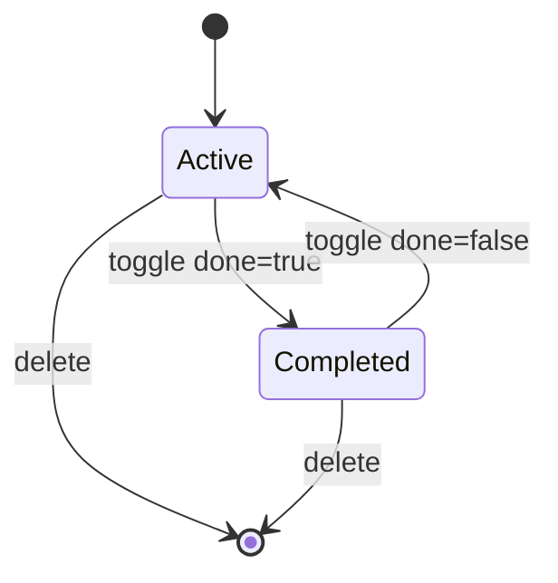

# TODO VERTICAL — SPECIFICATION

This is the **minimal** vertical spec for `apps/todo-instance/`. It is intentionally small so the factory workflow (Spec → PM → Dev → Quality → Git) can be exercised end-to-end.

## Document intent

- **Goal**: a single-user Todo list with the core CRUD-like operations.
- **MVP storage**: **local-only** persistence (in-browser), **no API**, **no auth**, **no multi-tenant**.
- **Later** (optional): add an API and/or shared packages; capture that in a new Phase section before implementing.

## Personas and goals

- **Primary user**: individual user
  - Capture tasks quickly
  - See what’s left
  - Mark done
  - Remove tasks

## Domain model

### Entities

- **Todo**
  - **id**: stable identifier (string or number)
  - **title**: short text
  - **done**: boolean
  - **createdAt**: timestamp (optional in MVP; required if sorting by recency is implemented)

### Relationships

- None (single entity MVP)

### Lifecycle / states

`Todo` state machine:

## MVP workflows (deterministic)

### 1) Add a todo

- **Trigger**: user submits the “new todo” input (enter key or button)
- **Rules**:
  - Title is trimmed
  - Empty titles are rejected (no-op)
- **Result**:
  - New Todo appears in list
  - Stored locally (see Storage)

### 2) List todos

- **Trigger**: app loads; user returns to the tab
- **Rules**:
  - Todos are loaded from local persistence
  - Order is deterministic (choose one for MVP):
    - Newest first (requires `createdAt`), or
    - Insertion order (array order)

### 3) Toggle complete

- **Trigger**: user clicks checkbox
- **Rules**:
  - `done` toggles true/false
  - UI reflects state (e.g. strike-through when done)
- **Result**:
  - Change persisted locally

### 4) Delete a todo

- **Trigger**: user clicks delete control on an item
- **Rules**:
  - Delete is immediate (no undo in MVP)
- **Result**:
  - Item removed from list and local persistence

## Storage & boundaries

### System boundaries (MVP)

- **UI**: `apps/todo-instance/` (React)
- **Persistence**: browser local storage (e.g. `localStorage`)
- **No backend**: no `/api`, no database, no external services

### Storage rules (MVP)

- Define a single storage key name (e.g. `todo.todos.v1`) so upgrades can version later.
- Serialization format: JSON array of `Todo`.
- Corrupt/missing data: fall back to empty list (do not crash).

## Non-functional requirements (MVP)

- **Performance**: handles at least **500** todos without noticeable UI lag on a typical dev machine.
- **Accessibility**: keyboard add/toggle/delete are possible (basic tab order + button semantics).
- **Security/Privacy**: no secrets; no PII; data remains on-device.

## Acceptance criteria (MVP)

### Functional

- User can **add** a todo with a non-empty title.
- User can **see a list** of todos after refresh (local persistence works).
- User can **toggle** a todo between active/completed.
- User can **delete** a todo.

### Out of scope (explicit)

- Accounts / auth / roles
- Multi-user sync
- Tags, priorities, due dates, reminders
- API/server/database
- Sharing/collaboration

---

## Phase 2 (next loop): Automated verification + testability hardening

Goal: reduce regression risk by making key behaviors **automatically verifiable** (unit + basic UI flow), so Quality is less reliant on manual checks.

### Scope

- Add an automated test harness for `apps/todo-instance/` (unit tests at minimum).
- Add tests for the most failure-prone behaviors:
  - local persistence survives refresh (load/save)
  - add rejects empty/whitespace titles
  - toggle and delete mutate the stored list
- Keep integration mode unchanged (still local-only, no API).

### Non-goals (Phase 2)

- Adding a backend/API
- Auth or multi-tenant behavior
- New domain fields (tags/due dates)

### Verification approach (Phase 2)

| Layer | What it proves | Evidence |
|------|-----------------|----------|
| Unit | Storage adapter correctness | `npm test` (or equivalent) |
| UI/component | CRUD behavior calls persistence correctly | test runner output |
| Build/lint | baseline compile + lint | `npm run build`, `npm run lint` |

### Acceptance criteria (Phase 2)

- `apps/todo-instance` has an automated test runner configured and runnable locally.
- At least these behaviors have automated coverage:
  - load returns `[]` on missing/corrupt storage
  - save writes valid JSON array under the versioned key
  - add rejects empty/whitespace titles
- Quality can verify Phase 2 without relying only on manual refresh checks (manual may remain supplemental).

## Open questions (for Phase 2+, answer before implementing)

- Should ordering be newest-first (requires `createdAt`) or insertion order?
- Do we want undo for delete?
- When adding an API, does `todo-instance` become HTTP-integrated to a `todo-api`, or remain standalone?

---

## Phase 3 (next loop): Persistence UX + filtering + bulk actions (still local-only)

Goal: make the todo app feel “real” for daily use while **keeping the architecture local-only** (no backend, no auth). This phase focuses on user experience and predictable state, with automated verification for the new behaviors.

### Scope

#### 1) Persistence and data migration (localStorage)

- Keep using a **versioned storage key** (e.g. `todo.todos.v1`).
- Introduce a **forward-compatible storage shape** (e.g. include a `schemaVersion` field in the persisted payload or a clear v2 key when/if we add new fields).
- On load:
  - Missing/corrupt data → empty list (no crash)
  - Older schema → migrate to current in-memory shape and persist back

#### 2) Filtering and counts

- Provide a deterministic filter UI with three states:
  - **All**
  - **Active**
  - **Completed**
- Show summary counts:
  - **items left** (active count)
  - optional: total count

#### 3) Bulk actions

- **Clear completed** (remove all completed todos)
- **Toggle all** (mark all active → completed, and if all are completed then mark all → active)

#### 4) UX & accessibility hardening

- Keep keyboard-first flows working:
  - Add todo without mouse
  - Toggle and delete reachable via keyboard
  - Bulk actions reachable via keyboard
- Ensure labels/roles are accessible (e.g. filter controls and bulk action buttons have clear accessible names).

### Non-goals (Phase 3)

- Backend/API/database
- Auth, multi-user, multi-tenant
- Tags, priorities, due dates, reminders
- Drag-and-drop reordering

### Verification approach (Phase 3)

Add automated coverage for the new behaviors:

- **Storage**: migration behavior (missing/corrupt/old schema → current)
- **UI**:
  - filter toggles (All/Active/Completed) correctly change visible items
  - clear completed removes only completed items
  - toggle all toggles expected state and persists
- **Gates**: `npm run lint`, `npm run build`, `npm run test` remain green

### Acceptance criteria (Phase 3)

- Filtering works deterministically (All/Active/Completed) and remains correct after refresh.
- Bulk actions work and persist:
  - clear completed
  - toggle all
- Migration behavior exists (even if it’s “v1 only today”), and corrupt/missing data never crashes the app.
- Automated tests cover the new behaviors sufficiently for Quality to gate without manual-only verification.

