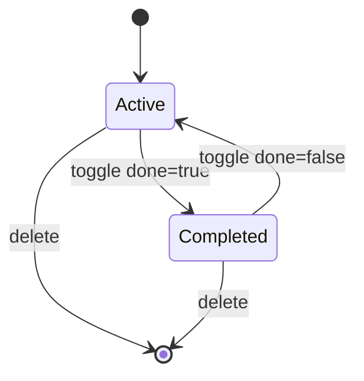

# TODO VERTICAL — SPECIFICATION

This is the **minimal** vertical spec for `apps/todo-instance/`. It is intentionally small so the factory workflow (Spec → PM → Dev → Quality → Git) can be exercised end-to-end.

## Document intent

- **Goal**: a single-user Todo list with the core CRUD-like operations.
- **MVP storage**: **local-only** persistence (in-browser), **no API**, **no auth**, **no multi-tenant**.
- **Later** (optional): add an API and/or shared packages; capture that in a new Phase section before implementing.

## Personas and goals

- **Primary user**: individual user
  - Capture tasks quickly
  - See what’s left
  - Mark done
  - Remove tasks

## Domain model

### Entities

- **Todo**
  - **id**: stable identifier (string or number)
  - **title**: short text
  - **done**: boolean
  - **createdAt**: timestamp (optional in MVP; required if sorting by recency is implemented)

### Relationships

- None (single entity MVP)

### Lifecycle / states

`Todo` state machine:

## MVP workflows (deterministic)

### 1) Add a todo

- **Trigger**: user submits the “new todo” input (enter key or button)
- **Rules**:
  - Title is trimmed
  - Empty titles are rejected (no-op)
- **Result**:
  - New Todo appears in list
  - Stored locally (see Storage)

### 2) List todos

- **Trigger**: app loads; user returns to the tab
- **Rules**:
  - Todos are loaded from local persistence
  - Order is deterministic (choose one for MVP):
    - Newest first (requires `createdAt`), or
    - Insertion order (array order)

### 3) Toggle complete

- **Trigger**: user clicks checkbox
- **Rules**:
  - `done` toggles true/false
  - UI reflects state (e.g. strike-through when done)
- **Result**:
  - Change persisted locally

### 4) Delete a todo

- **Trigger**: user clicks delete control on an item
- **Rules**:
  - Delete is immediate (no undo in MVP)
- **Result**:
  - Item removed from list and local persistence

## Storage & boundaries

### System boundaries (MVP)

- **UI**: `apps/todo-instance/` (React)
- **Persistence**: browser local storage (e.g. `localStorage`)
- **No backend**: no `/api`, no database, no external services

### Storage rules (MVP)

- Define a single storage key name (e.g. `todo.todos.v1`) so upgrades can version later.
- Serialization format: a versioned JSON payload: `{ schemaVersion, todos }` where `todos` is an array of `Todo`.
- Corrupt/missing data: fall back to empty list (do not crash).

## Non-functional requirements (MVP)

- **Performance**: handles at least **500** todos without noticeable UI lag on a typical dev machine.
- **Accessibility**: keyboard add/toggle/delete are possible (basic tab order + button semantics).
- **Security/Privacy**: no secrets; no PII; data remains on-device.

## Acceptance criteria (MVP)

### Functional

- User can **add** a todo with a non-empty title.
- User can **see a list** of todos after refresh (local persistence works).
- User can **toggle** a todo between active/completed.
- User can **delete** a todo.

### Out of scope (explicit)

- Accounts / auth / roles
- Multi-user sync
- Tags, priorities, due dates, reminders
- API/server/database
- Sharing/collaboration

---

## Phase 2 (next loop): Automated verification + testability hardening

Goal: reduce regression risk by making key behaviors **automatically verifiable** (unit + basic UI flow), so Quality is less reliant on manual checks.

### Scope

- Add an automated test harness for `apps/todo-instance/` (unit tests at minimum).
- Add tests for the most failure-prone behaviors:
  - local persistence survives refresh (load/save)
  - add rejects empty/whitespace titles
  - toggle and delete mutate the stored list
- Keep integration mode unchanged (still local-only, no API).

### Non-goals (Phase 2)

- Adding a backend/API
- Auth or multi-tenant behavior
- New domain fields (tags/due dates)

### Verification approach (Phase 2)

| Layer | What it proves | Evidence |
|------|-----------------|----------|
| Unit | Storage adapter correctness | `npm test` (or equivalent) |
| UI/component | CRUD behavior calls persistence correctly | test runner output |
| Build/lint | baseline compile + lint | `npm run build`, `npm run lint` |

### Acceptance criteria (Phase 2)

- `apps/todo-instance` has an automated test runner configured and runnable locally.
- At least these behaviors have automated coverage:
  - load returns `[]` on missing/corrupt storage
  - save writes valid JSON array under the versioned key
  - add rejects empty/whitespace titles
- Quality can verify Phase 2 without relying only on manual refresh checks (manual may remain supplemental).

## Open questions (for Phase 2+, answer before implementing)

- Should ordering be newest-first (requires `createdAt`) or insertion order?
- Do we want undo for delete?
- When adding an API, does `todo-instance` become HTTP-integrated to a `todo-api`, or remain standalone?

---

## Phase 3 (next loop): Persistence UX + filtering + bulk actions (still local-only)

Goal: make the todo app feel “real” for daily use while **keeping the architecture local-only** (no backend, no auth). This phase focuses on user experience and predictable state, with automated verification for the new behaviors.

### Scope

#### 1) Persistence and data migration (localStorage)

- Keep using a **versioned storage key** (e.g. `todo.todos.v1`).
- Introduce a **forward-compatible storage shape** (e.g. include a `schemaVersion` field in the persisted payload or a clear v2 key when/if we add new fields).
- On load:
  - Missing/corrupt data → empty list (no crash)
  - Older schema → migrate to current in-memory shape and persist back

#### 2) Filtering and counts

- Provide a deterministic filter UI with three states:
  - **All**
  - **Active**
  - **Completed**
- Show summary counts:
  - **items left** (active count)
  - optional: total count

#### 3) Bulk actions

- **Clear completed** (remove all completed todos)
- **Toggle all** (mark all active → completed, and if all are completed then mark all → active)

#### 4) UX & accessibility hardening

- Keep keyboard-first flows working:
  - Add todo without mouse
  - Toggle and delete reachable via keyboard
  - Bulk actions reachable via keyboard
- Ensure labels/roles are accessible (e.g. filter controls and bulk action buttons have clear accessible names).

### Non-goals (Phase 3)

- Backend/API/database
- Auth, multi-user, multi-tenant
- Tags, priorities, due dates, reminders
- Drag-and-drop reordering

### Verification approach (Phase 3)

Add automated coverage for the new behaviors:

- **Storage**: migration behavior (missing/corrupt/old schema → current)
- **UI**:
  - filter toggles (All/Active/Completed) correctly change visible items
  - clear completed removes only completed items
  - toggle all toggles expected state and persists
- **Gates**: `npm run lint`, `npm run build`, `npm run test` remain green

### Acceptance criteria (Phase 3)

- Filtering works deterministically (All/Active/Completed) and remains correct after refresh.
- Bulk actions work and persist:
  - clear completed
  - toggle all
- Migration behavior exists (even if it’s “v1 only today”), and corrupt/missing data never crashes the app.
- Automated tests cover the new behaviors sufficiently for Quality to gate without manual-only verification.

---

## Phase 4 (next loop): Local-only polish + maintainability

Goal: improve maintainability and UX polish **without changing the integration mode**. The app remains **local-only** (no API, no auth, no multi-tenant).

### Scope

#### 1) Maintainability refactor (no behavior changes)

- Split `App.tsx` into small, predictable modules:
  - `src/todos.model.ts` for pure helpers (filtering, bulk action intent like “toggle all” decision, counts helpers).
  - Components such as `Filters`, `BulkActions`, and `TodoList` (exact filenames may vary; keep them minimal).
- Keep `todos.storage.ts` as the persistence adapter boundary.
- Preserve existing behaviors and tests while refactoring (refactor-first slice).

#### 2) Empty state + copy polish

- When there are **0 todos**, show a clear empty state (text + focus guidance).
- Keep keyboard-first add flow intact.

#### 3) Inline edit title (local-only)

- User can edit a todo title in-place.
- Keyboard behavior:
  - `Enter` saves
  - `Escape` cancels
- Title is trimmed; empty/whitespace-only edits are rejected (no-op or revert).
- Changes persist to local storage.

#### 4) Optional: undo delete (local-only)

- Provide a lightweight undo for delete (time-boxed in-memory buffer is acceptable).
- Undo should not require backend or durable history.

### Non-goals (Phase 4)

- Backend/API/database
- Auth, multi-user, multi-tenant
- Tags, priorities, due dates, reminders
- Drag-and-drop reordering

### Verification approach (Phase 4)

- Maintain existing unit/component coverage while refactoring (tests should not become brittle).
- Add UI tests for:
  - empty state rendering when list is empty
  - inline edit save/cancel keyboard flows
  - optional undo delete flow (if implemented)
- Gates remain the same: `npm run lint`, `npm run build`, `npm run test` are green.

### Acceptance criteria (Phase 4)

- `App.tsx` is decomposed into smaller modules with clear boundaries; behavior unchanged and tests still pass.
- Empty state is present and accessible when there are zero todos.
- Inline edit works with Enter/Escape behavior, trims input, and persists changes.
- If undo delete is implemented, it works without backend and has automated coverage.

---

## Phase 5 (next loop): Hardening — forward schema guardrails + planning consistency

Goal: close the last “future-proofing” gaps while keeping the app **local-only** (no API, no auth). This phase focuses on making our storage migration story explicit for future schema changes, and keeping the factory planning metadata consistent.

### Scope

#### 1) Forward schema guardrail (`schemaVersion > current`)

- Persisted storage uses a versioned payload `{ schemaVersion, todos }`.
- On load:
  - Missing/corrupt data → empty list (no crash)
  - Older schema → migrate to current in-memory shape and persist back (already supported)
  - **Future schema** (`schemaVersion > current`) → **do not crash**, and do not accidentally overwrite unknown data with an empty save. Choose a deterministic safe fallback (e.g. return `[]` and treat data as unreadable).

#### 2) Phase field convention in the factory queue

- Task queue `phase` values must be **numeric strings** (e.g. `"3"`, `"4"`, `"5"`), not mixed formats like `"Phase 3"`.
- Add/strengthen validation so invalid `phase` values are caught early during checks.

### Non-goals (Phase 5)

- Backend/API/database
- Auth, multi-user, multi-tenant
- New todo domain features (tags, due dates, priorities)

### Verification approach (Phase 5)

- Add automated tests for the forward-schema guardrail behavior in storage.
- Gates remain the same: `npm run lint`, `npm run build`, `npm run test` are green.

### Acceptance criteria (Phase 5)

- Forward schema guardrail behavior is explicit and covered by automated tests.
- Factory validation catches non-numeric `phase` values with clear error output.

---

## Phase 6 (next loop): Local-only UX upgrades (still no API)

Goal: add a couple of “real app” quality-of-life features while staying **strictly local-only** (no backend, no auth, no sync).

### Scope

#### 1) Export / import todos (local-only)

- Add an **Export** action that downloads the current todos as JSON (versioned payload `{ schemaVersion, todos }`).
- Add an **Import** action that accepts JSON:
  - Supports the current payload shape `{ schemaVersion, todos }`
  - Supports legacy array format (migrate like storage does)
  - Rejects invalid input without crashing the app

#### 2) Deterministic ordering

- Ensure ordering is deterministic and documented:
  - New todos have `createdAt` set.
  - Visible list ordering is consistent (e.g. newest-first by `createdAt`, falling back safely if missing).

### Non-goals (Phase 6)

- Backend/API/database
- Auth, multi-user, multi-tenant
- Sync across devices

### Verification approach (Phase 6)

- Add automated tests for:
  - export payload shape
  - import accepts v1 payload and legacy array
  - invalid import does not crash and does not corrupt existing state
- Gates remain: `npm run lint`, `npm run build`, `npm run test`, `npm run check`.

### Acceptance criteria (Phase 6)

- Export and import work end-to-end and are resilient to invalid input.
- Ordering remains deterministic after add/toggle/delete/import and refresh.
---

## Phase 7 (next loop): UX / UI polish — local-only

**Architecture alignment:** `organizational_memory/architecture-review-002-2026-05-08.md` and **`organizational_memory/architecture-review-003-2026-05-08-phase7-ui-stack.md`**. Stay **standalone / local-only**; no API, auth, or sync. Integration mode remains **standalone**.

### Implementation stack (Phase 7) — required

- **Tailwind CSS** — utility-first styling; use `tailwind.config` **`theme.extend`** for shared **design tokens** (colors, spacing, font sizes, radii, shadows). Prefer Tailwind **`dark:`** variants; default strategy is **`prefers-color-scheme`** (`darkMode: 'media'`). This repo **pins Tailwind v3** with **PostCSS** for a stable Vite pipeline; moving to **v4** requires `@tailwindcss/postcss` or `@tailwindcss/vite` — treat as a **Tooling/ADR** change, not silent drift.
- **Headless UI** — **`@headlessui/react`** as the **lightweight** component layer for accessible primitives (e.g. **`Button`**, **`Listbox`** for filter control, **`Menu`** or **`Popover`** only if needed). Style primitives with Tailwind classes; do **not** adopt a heavy kit (MUI/Chakra) in this phase.

### Goal

Make `apps/todo-instance` feel like a **cohesive product**: readable typography, consistent spacing, clear interactive states, **system light/dark** support, and **explicit user feedback** for import/export outcomes—without changing domain rules (still the same Todo model and storage contract).

### Scope

#### 1) Tooling + entry (local-only)

- Add **Tailwind** + **PostCSS** (or Vite-native Tailwind integration per repo choice) and import a global **`src/index.css`** from **`main.tsx`** with Tailwind directives.
- Add **`@headlessui/react`** dependency; tree-shake imports (no unused components).

#### 2) Visual system + layout (local-only)

- **Tokens:** centralize in **Tailwind theme extension** (utilities + optional CSS variables via `theme` if needed).
- **Layout:** page shell with clear hierarchy (header / main / footer utility row if needed); comfortable **max-width** on large screens; touch-friendly hit targets.
- **States:** visible **focus** styles (Tailwind `focus-visible:`); hover/active where appropriate.
- **Theme:** **light and dark** via **`prefers-color-scheme`** at minimum. Optional: **manual theme toggle** persisted in `localStorage` using Tailwind **`class`** dark mode—document behavior so it does not fight system preference confusingly.

#### 3) User feedback for critical actions (local-only)

- **Import:** after import attempt, user sees a **clear message** for success vs rejection (invalid JSON, empty payload, forward-schema refusal, etc.)—not silent failure or console-only. Prefer **`role="status"`** / **`aria-live="polite"`** (can wrap Headless **Transition** for subtle UI if desired).
- **Export:** brief confirmation is acceptable (status text or live region).
- Copy stays **English** (full **i18n** is a non-goal).

#### 4) Accessibility scaffolding (local-only)

- **`main` landmark**, sensible **`h1`**, appropriate list markup for todos.
- No regression to existing keyboard flows (add, filters, bulk actions, inline edit, undo).

### Non-goals (Phase 7)

- Backend/API/database, auth, multi-tenant, sync
- Heavy UI kits (**MUI**, **Chakra**, **Mantine**); **daisyUI** unless PM opens a later phase
- **Drag-and-drop reorder** (deferred)
- Full **internationalization**
- **Virtualized** long lists (optional future NFR)

### Verification approach (Phase 7)

- **Manual:** spot-check in light and dark; verify Headless + keyboard on filter/add paths.
- **Automated:** UI tests cover **import feedback** (failure + success paths), **landmark** / heading, and a **stable** Tailwind/dark signal (e.g. `class` on `html`, or `data-*` set by theme helper)—avoid brittle full-page snapshots.
- Gates: `npm run lint`, `npm run build`, `npm run test`, `npm run check` remain green.

### Acceptance criteria (Phase 7)

- **Tailwind** and **Headless UI** are **wired** (`package.json`, config, global CSS entry); production build succeeds.
- UI uses **shared Tailwind tokens** and looks **intentionally designed**—not unstyled browser defaults only.
- **Light and dark** work via **`prefers-color-scheme`** at minimum; optional manual toggle documented if present.
- Import/export outcomes surface **user-visible, accessible** feedback.
- **Landmarks / headings** meet the scope; existing keyboard-first flows still work.
- Tests and quality gates pass per verification approach.
